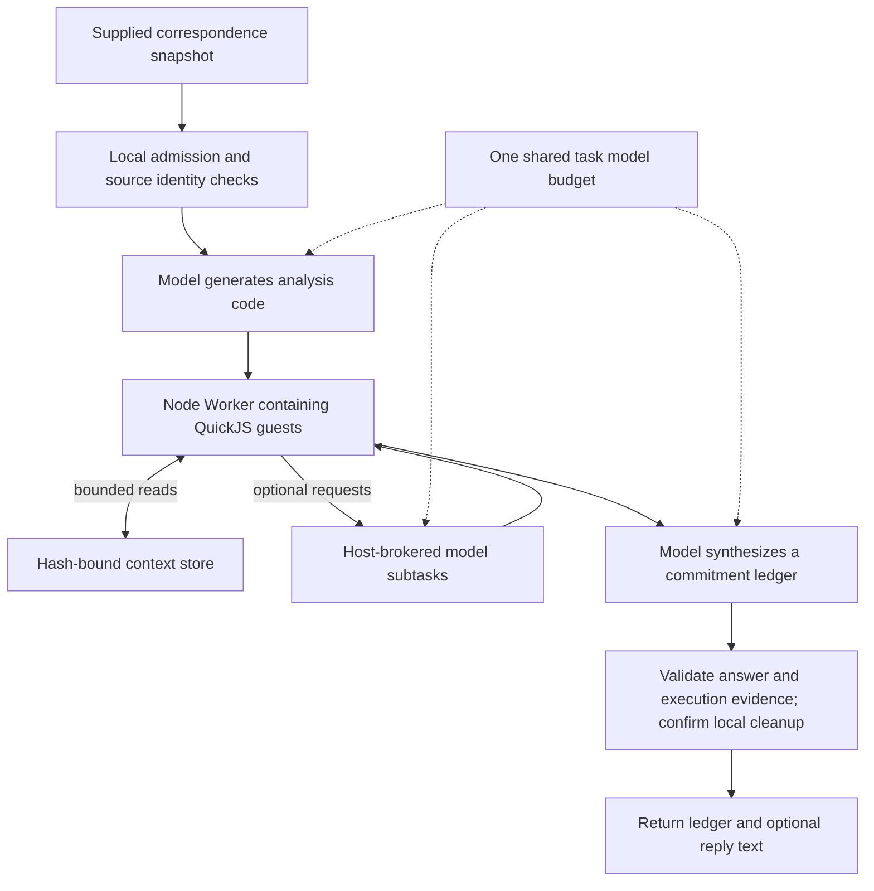

# Commitment Workbench

[How it works](#how-it-works) · [Benchmarks](#benchmarks) · [Development approach](#development-approach) · [Try it](#try-it-without-a-model-call)

[Contribution map](docs/CONTRIBUTIONS.md) · [Technical walkthrough](docs/WALKTHROUGH.md) · [Upstream project guide](UPSTREAM.md)

**Promises, not just messages.** Review a correspondence snapshot, identify who owes what, and attach exact source spans to each commitment.

An independent, AI-assisted extension of [Habenula](https://github.com/habenula-ai/habenula-oss), based on upstream commit `eb5b9462f514a10a1312a76d7e09bb07c9598609`. Experimental and local-first. Not an official release or an endorsed contribution.

## What changes

| Upstream foundation | This fork adds |
|---|---|
| Action governance, confirmations, credential custody, audit chain, integrations, ordinary agent, CLI and MCP | An explicit commitment-review workflow, approved/versioned guidance, and optional bounded programmatic-context analysis |

The output is a source-linked **CommitmentLedger** and optional reply **text**. Reviewing a snapshot does not connect a mailbox, save a draft, or send a message. Guidance does not grant permissions.

## Review it in two minutes

1. **Contract:** inspect the [snapshot and ledger schemas](packages/contracts/src/workflows.ts).
2. **Execution:** follow the [service](packages/engine/src/workflows/service.ts) → [RLM coordinator](packages/engine/src/workflows/rlm-runtime.ts) → [private Node backend](packages/engine/src/rlm/node-backend.mjs).
3. **Hard boundary:** see why [native I/O settlement](packages/engine/src/llm/native-operation-scope.ts) is not the same as an aborted promise.
4. **Evidence:** read the [benchmark report](docs/BENCHMARKS.md), [limitations](docs/LIMITS.md), and [AI-assistance disclosure](docs/DEVELOPMENT.md).

[Architecture lesson](docs/ARCHITECTURE.md) · [Reviewer guide](docs/REVIEW_GUIDE.md) · [Run from source](docs/QUICKSTART.md) · [Failure and repair](docs/REPAIR.md)

## How it works

The RLM path lets a model propose computation without giving that computation authority to act. The host keeps the budget, validation, provider access, and decision to return an answer.



1. **Bind the input.** Validate the snapshot and build an answer-free source-offset index. A hash identifies the supplied data; it does not prove that the data is true.
2. **Generate and execute.** The model returns a code envelope, not an ordinary answer. Real QuickJS executes that code against separately stored context. The guest has no direct Node file, network, or service capabilities.
3. **Broker optional subtasks.** The host—not the guest—dispatches model requests through the same task budget. Small contexts can need zero children. Extra decomposition is not automatically better.
4. **Synthesize and validate.** Check the ledger against exact source spans and the workflow contract. For RLM, also require host-observed execution and read evidence. These mechanical checks do not prove semantic correctness.
5. **Close before success.** Confirm the required local resource settlement. Incomplete RLM execution cannot become a valid-looking ledger through a hidden baseline fallback. Local closure does not prove remote inference or billing stopped.

Ordinary chat remains ordinary chat. RLM is an explicit, **default-off** review mode. The baseline review skips generated-code execution; refinements are approved/versioned guidance, not model-weight training or new permissions.

<details>
<summary>Current bounds and authority limits</summary>

| Boundary | Current application limit |
|---|---|
| Model calls | 10 shared attempts; concurrency ceiling 2 |
| Task time | 300 seconds; includes codegen, child calls, synthesis, and possible repair |
| Guest requests / depth | At most 3 requests; maximum depth 1 |
| Guest VMs | At most 4 total; children share the Worker's WASM memory |
| Child prompts | 4,096 UTF-8 bytes each; 8,192 aggregate |
| Guest completion | 8,192 UTF-8 bytes |
| Output repair | At most 1; not an extra independent budget |
| Input snapshot | At most 32 messages; 96,000 total body UTF-16 code units |

The app's selected limits differ from the primitive protocol ceilings. Byte, character, and token limits are different units. These caps are not a universal native-process containment guarantee. The local caller token is not general account authentication or proof of human presence.

</details>

[Full architecture and source links](docs/ARCHITECTURE.md) · [Limits](docs/LIMITS.md) · [Technical walkthrough and exercises](docs/WALKTHROUGH.md)

## What is verified

**Current local regression status is not clean.** The privacy-normalized source rebuild and offline ledger recheck passed. Three unchanged native-suite attempts passed **57/59, 58/59, and 58/59** tests, with different guest-runtime cases failing. The exact cause is unresolved. A separate targeted diagnostic passed, but does not replace a whole-suite pass. This is experimental source, not a release-ready reliability claim.

The following results describe the earlier staged revision, before the privacy projection:

| Check | Recorded result | Scope |
|---|---|---|
| Source build | Pass | Seven-package build using existing locked dependencies |
| Native RLM tests | **59 passed** | Actual Worker/QuickJS behavior with controlled provider/client fixtures |
| Engine tests | **1,168 passed across 104 files** | Engine suite, not live-model efficacy |
| Compiled-daemon/API fixture | Pass | Real daemon/private binding/Worker/QuickJS path; authored provider replies |
| Public evidence recheck | Pass | Both released ledgers revalidated and rescored offline |

These historical checks preceded privacy-only comment/example/documentation edits. They are not GitHub CI, a fresh network install, or an installed-release verification. [Verification summary](evidence/verification.json).

## Benchmarks

**Incomplete pilot—not a benchmark win.** The frozen plan covered four synthetic cases and three arms. Five runs produced recorded outcomes. One later admission has no recovered result or shutdown receipt; six rows were not run. The protocol stopped rather than replaying the uncertain run or changing its rules.

| Case | Arm | Outcome | Checks | Seconds |
|---|---|---|---:|---:|
| fresh-07 | Stock | Invalid output | — | 179.683 |
| fresh-07 | Baseline | Contract-valid | 7/8 | 257.589 |
| fresh-07 | RLM | Contract-valid | 8/8 | 177.205 |
| fresh-13 | Baseline | Deadline / cancelled | — | 300.162 |
| fresh-13 | RLM | Execution incomplete | — | 101.452 |
| fresh-13 | Stock | Interrupted / unknown | — | — |
| fresh-08 | Stock | Not run | — | — |
| fresh-08 | RLM | Not run | — | — |
| fresh-08 | Baseline | Not run | — | — |
| fresh-14 | RLM | Not run | — | — |
| fresh-14 | Baseline | Not run | — | — |
| fresh-14 | Stock | Not run | — | — |

**Read this comparison carefully:**

- Stock retains the original agent's system, tools, and **1,024-output-token cap**. Stock versus modified is a **product-default comparison**, not an isolated RLM experiment.
- Baseline versus RLM shares the snapshot, validator, task model budget, and single-repair policy. On `fresh-07`, baseline passed **7/8** authored checks; RLM passed **8/8**. On the demanding case, baseline hit its deadline and RLM failed to complete execution.
- The successful RLM run used real guest execution and reads, with **two root calls and zero child calls**. It does not establish complete live recursive-child success.
- Provider-account details and observed token usage are withheld for privacy. A faster failure is not a speedup.
- Cases and oracles are authored synthetic fixtures, not a blind or representative sample. Gold answers were used only for offline scoring, never in model input. No human semantic-verification claim is made.

<details>
<summary>Frozen method and the earlier repair</summary>

Provider/model identity and account routing are withheld in this privacy-normalized public projection. That limits independent reproduction of the historical provider conditions. The same configured model route was used across the recorded arms; temperature and effort were unspecified. Each row used fresh private state and a cold daemon. Task latency excludes startup/shutdown.

The modified task budget stayed at 300 seconds, with a 330-second outer task wait and 370-second native supervisor. Prompts, limits, model route, source, artifacts, and inputs were frozen before inference. Missing native shutdown evidence stops further admission. The interrupted row remains **unknown**, not a fabricated application failure or zero-cost run.

An older cohort remains separate: four attempted rows and eight unrun. A separately scoped prompt-contract repair regression passed **8/8** checks in **230.274 seconds**, with two root/zero child calls. The repair clarified actual byte caps, unavailable globals, and source retrieval. It did **not** raise limits or add fallback. The later demanding-case failure remains visible; the repair was not a universal fix.

</details>

[Full report and limitations](docs/BENCHMARKS.md) · [Frozen protocol](evidence/comparison-02/protocol.json) · [All result rows](evidence/comparison-02/results.json) · [Failure → repair lesson](docs/REPAIR.md)

## Development approach

This was substantially **AI-assisted**. Assistants contributed to implementation, testing, investigation, review, and documentation. Upstream built the original product and governance infrastructure; this is not presented as unaided human authorship.

The development process used isolated source candidates, regression tests, bounded native commands, and evidence-backed checkpoints. Development tooling is separate from the application's TypeScript/Node/QuickJS runtime. Reviews were author-associated, not independent security certification.

Personal development sessions, provider-account details, and AI usage accounting are not distributed. The public material focuses on implementation, synthetic outcomes, limitations, and reproducible offline checks.

[Engineering process](docs/DEVELOPMENT.md) · [Contribution map](docs/CONTRIBUTIONS.md)

## Try it without a model call

After cloning this fork, use the pinned tools and build from source:

```sh
mise install
npm ci
just oss-build
node --import tsx tools/recheck-evidence.mjs
```

The final command checks the privacy projection identities, result accounting, saved response parsing, and both published ledgers with the actual validator/oracle scorer. Historical source identity and the public privacy projection are distinct. **It makes no model request.** It reproduces the saved scores; it does not independently attest historical execution.

The recorded build used existing locked dependencies. A clean network `npm ci` and other platforms were not verified. Use the **local built CLI**, not `npx habenula`, to exercise this fork; the npm package is upstream. Live inference is optional and requires your own authorized setup. [Full source quickstart](docs/QUICKSTART.md).

## Credit and scope

Upstream Habenula supplies the original product and governance infrastructure. QuickJS/quickjs-emscripten supplies the guest interpreter. [Recursive Language Models](https://github.com/alexzhang13/rlm) is a conceptual reference, not an invention claimed here. AI assistants contributed substantially to implementation and review; see [AI-assistance disclosure](docs/DEVELOPMENT.md).

The default code license remains **AGPL-3.0-only**, with the existing **MIT audit-package** and third-party exceptions. Package documentation retains its **CC BY 4.0** terms and supplemental code-example grant. Read [LICENSE](LICENSE), [LICENSE_FAQ.md](LICENSE_FAQ.md), [TRADEMARKS.md](TRADEMARKS.md), and [fork provenance](docs/FORK_PROVENANCE.md). Attribution review is not a legal clearance or a CLA signature.

Habenula and Benya are trademarks of Habenula, Inc.
