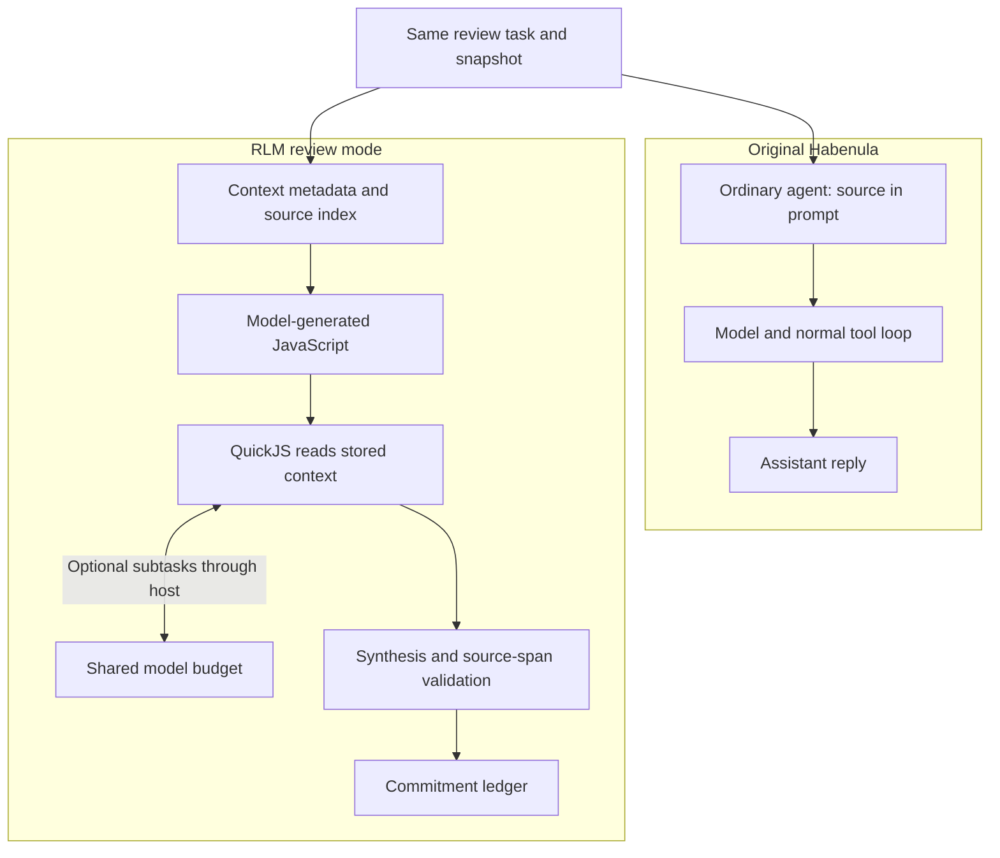

# Commitment Workbench

**Find who owes what in a conversation—and cite the exact messages.**

An experimental, AI-assisted fork of [Habenula](https://github.com/habenula-ai/habenula-oss). It reviews supplied correspondence snapshots, not live mailboxes. It returns a commitment ledger; it does not send messages.

## What this fork adds

- **Source-linked answers.** Owners, deadlines, changed commitments, and uncertainty, with exact source spans checked by the [validator](packages/engine/src/workflows/commitment-handoff.ts).
- **Executable context analysis.** The model writes JavaScript; [QuickJS runs it](packages/engine/src/rlm/worker.mjs) over stored context. Optional model subtasks go through the host. The guest gets no direct file, network, or service access.
- **One budget across calls.** Root calls, children, and repair share a [task budget](packages/engine/src/workflows/model-budget.ts). [Native tracking](packages/engine/src/llm/native-operation-scope.ts) distinguishes an aborted promise from work that has actually stopped. Incomplete RLM execution does not silently fall back to baseline.
- **Controlled guidance.** [Versioned refinements](packages/engine/src/refinements/manager.ts) require qualification and explicit activation, with rollback. Guidance never grants permissions.

## Original vs. RLM



This compares execution paths, not measured speed. Stock keeps its product defaults; RLM adds a separate review workflow.

The host controls model access, budgets, validation, and local cleanup. RLM mode is opt-in; ordinary chat is unchanged. [Architecture →](docs/ARCHITECTURE.md)

## Evidence

| Synthetic case | Stock defaults | Baseline | RLM |
|---|---|---|---|
| Routine | Invalid output | 7/8 checks | **8/8 checks** |
| Demanding | Outcome unknown | Deadline | Execution failed |

Five recorded outcomes, one interrupted/unknown run, six unrun. Stock and modified arms have different defaults. The successful RLM case used real guest execution but no child calls; no general speedup or complete live recursive-child success is established. [Full results →](docs/BENCHMARKS.md)

**Build and offline ledger checks pass. The native suite is not clean:** latest attempt 58/59; failures remain unresolved. [Verification →](evidence/verification.json)

## Run the evidence check

```sh
mise install
npm ci
just oss-build
node --import tsx tools/recheck-evidence.mjs
```

The last command rescores saved synthetic outputs without calling a model. The verified build reused locked dependencies; a clean network install was not verified. [Source setup →](docs/QUICKSTART.md)

[What changed](docs/CONTRIBUTIONS.md) · [Build story](docs/DEVELOPMENT.md) · [Technical walkthrough](docs/WALKTHROUGH.md)

---

Habenula supplies the original agent, governance, credentials, audit, and integrations. This fork adds the review workflow and bounded analysis path. Substantial AI assistance; not an official Habenula release. QuickJS and [Recursive Language Models](https://github.com/alexzhang13/rlm) are credited prior work.

[AGPL-3.0-only](LICENSE), with existing MIT/third-party and documentation-license exceptions. [Provenance and notices](docs/FORK_PROVENANCE.md) · [Trademarks](TRADEMARKS.md)
