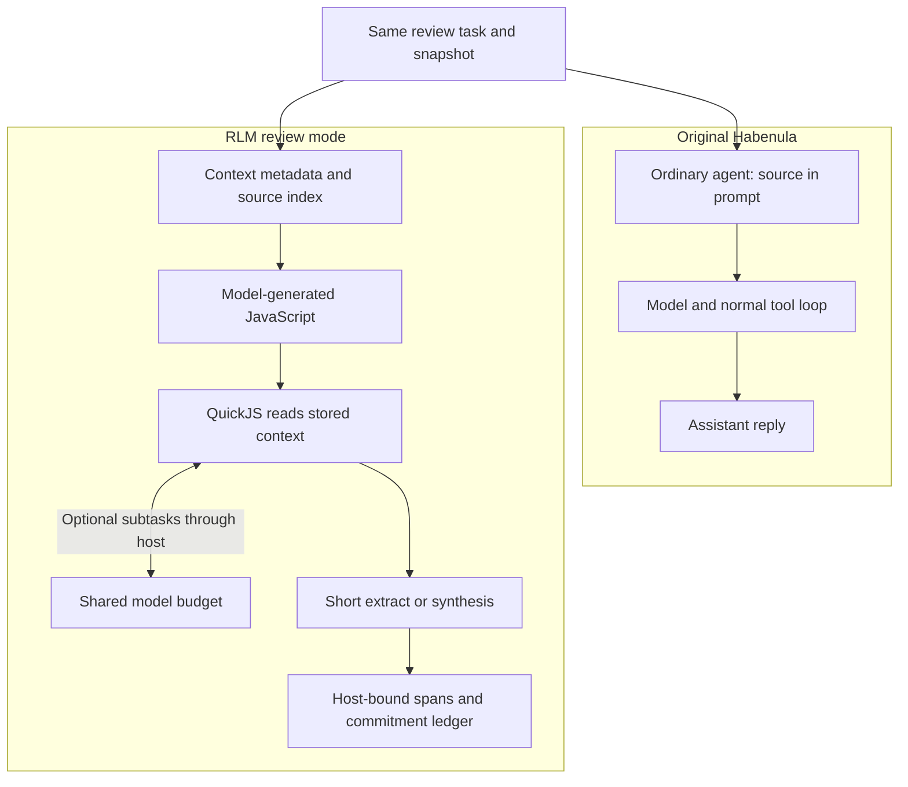

# Commitment Workbench

**Find who owes what in a conversation—and cite the exact messages.**

An experimental, AI-assisted fork of [Habenula](https://github.com/habenula-ai/habenula-oss). It reviews supplied correspondence snapshots, not live mailboxes. It returns a commitment ledger; it does not send messages.

I used this as intern-application work. I did not write Habenula. I added RLM review, then made it return a ledger where stock chat truncated or never came back.

## What I actually fixed

- **The client aborted at 310s.** RLM review was still synthesizing. The CLI long-deadline is now above the task wall. Test: [refinement-client.test.ts](packages/cli/test/refinement-client.test.ts).
- **Findings were capped at 8KiB.** A 13KiB snapshot became truncated JSON. The host can recover the real snapshot and, for large cases, run short extracts instead of one huge ledger rewrite. Tests: [prompt-contract.test.mjs](packages/engine/test-node/rlm/prompt-contract.test.mjs), [host-ledger.test.mjs](packages/engine/test-node/rlm/host-ledger.test.mjs).
- **Full-schema synthesis hung.** Guest retrieve + short extract + host-bound UTF-16 spans is the path that produced a contract-valid ledger on a demanding snapshot. Stock returned no packet on that case.

This is intern-scale systems work: find the timeout, the byte cap, and the hang, then measure. It is not a claim that RLM is generally faster or always better.

## What this fork adds

- **Source-linked answers.** Owners, deadlines, changed commitments, and uncertainty, with exact source spans checked by the [validator](packages/engine/src/workflows/commitment-handoff.ts).
- **Executable context analysis.** The model writes JavaScript; [QuickJS runs it](packages/engine/src/rlm/worker.mjs) over stored context. Optional model subtasks go through the host.
- **One budget across calls.** Root calls, children, and repair share a [task budget](packages/engine/src/workflows/model-budget.ts). Incomplete RLM execution does not silently fall back to baseline.
- **Controlled guidance.** [Versioned refinements](packages/engine/src/refinements/manager.ts) require qualification and explicit activation.

## Original vs. RLM



This compares execution paths, not measured speed. [Architecture →](docs/ARCHITECTURE.md)

## Evidence

| Synthetic case | Stock defaults | Baseline | RLM |
|---|---|---|---|
| Routine | Invalid output | 7/8 checks | **8/8 checks** |
| Demanding | Outcome unknown | Deadline | Frozen cohort: failed. Later recovery: contract-valid ledger; oracle matching was not clean |

Five recorded outcomes in the frozen cohort, one interrupted/unknown run, six unrun. A later local recovery path is **not** part of that frozen protocol. No general speedup is claimed. [Full results →](docs/BENCHMARKS.md)

**Build and offline ledger checks pass. The native suite is not clean:** latest attempt 58/59. [Verification →](evidence/verification.json)

## Run the evidence check

```sh
mise install
npm ci
just oss-build
node --import tsx tools/recheck-evidence.mjs
node --test packages/engine/test-node/rlm/host-ledger.test.mjs packages/engine/test-node/rlm/prompt-contract.test.mjs
```

The recheck rescores saved synthetic outputs without calling a model. [Source setup →](docs/QUICKSTART.md)

[What changed](docs/CONTRIBUTIONS.md) · [Build story](docs/DEVELOPMENT.md) · [Technical walkthrough](docs/WALKTHROUGH.md)

---

Habenula supplies the original agent, governance, credentials, audit, and integrations. Substantial AI assistance; not an official Habenula release. QuickJS and [Recursive Language Models](https://github.com/alexzhang13/rlm) are credited prior work.

[AGPL-3.0-only](LICENSE), with existing MIT/third-party and documentation-license exceptions. [Provenance and notices](docs/FORK_PROVENANCE.md) · [Trademarks](TRADEMARKS.md)
