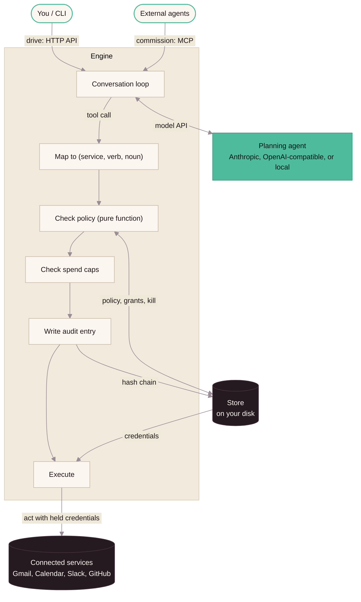

> **Historical upstream README.** Retained from Habenula commit `eb5b9462f514a10a1312a76d7e09bb07c9598609`. This describes the upstream product, not a published release of this fork. Its npm commands install upstream. Use [the fork quickstart](docs/QUICKSTART.md) for the extension. The upstream demo image URL is relocated to that exact commit; it is not a fork demo.

# Habenula

## The personal agent control harness

[](#license)

An AI agent acting on your behalf can now send email, spend money, delete project files, and post in your name.

**Powerful agents need powerful controls to keep the user in charge.**

---

### The model still does the thinking; **[Habenula](https://habenula.ai)** governs the *doing*.

Every consequential action an agent takes is:

- **Checked** against your rules — a pure function, no LLM judgement.
- **Logged** to a tamper-evident chain you can verify yourself.
- **Run** only with the authority you granted.
- **Killable** — `habenula kill` revokes all of it at once.

All in a deterministic environment the model can't overrule or misrepresent.

Habenula runs two ways: as a **sidecar** to a coding agent like Cursor or
Claude Code — you point its MCP config at Habenula, and your agent can hand off consequential actions for you to approve — or
**standalone**, as its own governed agent driven from the CLI. Governance holds
identically either way.

---

### What this gives you

**Enterprise-style governance, without the enterprise.** The governance large organizations are building themselves, packaged as a product to be runnable by one person.

**Independence you keep.** Precise policies, custom to you, across a wide range of vendors and models.

**Powerful guards for when it matters.** More flexible, reliable, and secure than a generic "approve this?" prompt.

**Trust backed by the security community, not the model.** Everything you need to run it is open source, in one repository.

---

Here it is at its simplest in a recorded session — the agent goes to send an email, and the send
holds for your confirmation:

<table><tr><td>

</td></tr></table>

The same session, as text:

```
> Send an email to sam@example.com with the subject "Q3 numbers" and this exact
body: Revenue was up 12% quarter over quarter.
Habenula › A tool call is awaiting your confirmation:
    gmail · send · "sam@example.com"
    requested with:
      "to": ["sam@example.com"]
      "subject": "Q3 numbers"
      "body": "Revenue was up 12% quarter over quarter."

  1. Deny — don't run this; nothing is granted.
  2. Tell me more — show what this tool does (no decision yet).
  3. Allow — for this task.
  4. Allow — for this session (~89m left).
```

The `gmail · send` line is the entire permission: a service, a verb, and the
exact thing being acted on. Answer **3** and the grant is consumed by that one
call. Answer **4** and it lasts until the session ends. A different recipient
is a different permission, so it asks again. There is no "always allow".
`habenula kill` clears every grant at once; with none in force, the agent
can do nothing.

## Contents

- [What makes it different](#what-makes-it-different)
- [Quick start](#quick-start) · [Self-hosting](#self-hosting) · [Running from source](#running-from-source)
- [Architecture](#architecture-at-a-glance) · [Packages](#packages) · [Documentation](#documentation) · [External resources](#external-resources)
- [About this repository](#about-this-repository) · [Security](#security) · [License](#license) · [Trademarks](#trademarks)
- [Privacy](#privacy) · [Legal](#legal)

## What makes it different

- **Independent, deterministic runtime** — governance is code, not a prompt. The
  same inputs always reach the same decision, and no amount of clever wording
  from the model can talk it into a yes.
- **Credential isolation** — the agent can act in your Gmail but never sees the
  token behind it. Habenula holds the keys and hands over access one call at a
  time; the model only ever gets the result.
- **Audit log** — every action lands in an append-only, SHA-256 hash-chained log
  before it runs, so the history can't be quietly rewritten. `habenula log
  verify` recomputes the whole chain on your own machine.
- **Kill switch** — one command, `habenula kill`, and every agent stops and every
  grant clears — a global deny that lands in tens of milliseconds.
- **Required scope bindings** — every action binds to a target — send
  *to* a recipient, read *from* a folder — never a verb on its own. Scope it
  tight or widen it deliberately; either way an agent
  only ever holds what it was given.
- **MCP surfaces** — other agents can hand work to yours over the Model Context
  Protocol, and your CLI drives it over a trusted local interface. Both ends run
  through the same governance.

**Current status:** early alpha, and the first open-source release. The agent
runtime, governance pipeline, and CLI are functional, with integrations for
Gmail, Google Calendar, Outlook Mail, Slack, and GitHub. One agent runs in one
session at a time. Authentication is not yet implemented (see
[SECURITY.md](SECURITY.md)).

## Quick start

The fastest way to try Habenula — no checkout, from npm with provenance:

```bash
npx habenula up      # start a local engine on loopback; prints the URL it serves
npx habenula         # open the governed conversation
```

The `habenula` package is the front door: it carries the CLI and the engine as exact-pinned dependencies, so one npm resolution installs the whole product and `up` finds the engine inside the same install — no second download. The first `up` writes your secrets to `~/.habenula/config`. Back that file up: without its key, your stored credentials cannot be read again. A conversation also needs a model backend — point it at Anthropic, any OpenAI-compatible endpoint, or a local model such as Ollama. `npx habenula down` stops the engine it started.

The engine runs on loopback and has no authentication yet, so the local machine is the trust boundary — never expose the port. For the full container path, see [Self-hosting](#self-hosting). To read or modify the code, see [Running from source](#running-from-source).

## Self-hosting

**Start here if you want to use Habenula.** This repository holds the full
agent runtime: the engine, the governance pipeline, the credential vault, and
the CLI. You run the engine on your own hardware, and your credentials stay
encrypted on your own disk. You manage your own state and backups. You supply
the model backend: an Anthropic API key, or any OpenAI-compatible endpoint,
including a local one such as Ollama.

**The engine has no authentication yet.** The supported path runs it on your
machine's loopback interface, so the local machine is the trust boundary.
Never publish the port to a network. Start with the
[self-host runbook](SELF-HOSTING.md). It covers the
container path end to end and leads with that boundary.

The packages also publish to npm, with provenance, and one name is the front
door: `npx habenula up` starts a local engine when none is running and reports
the URL it serves. The unscoped `habenula` package pins the CLI and the engine
as exact dependencies, so that one command resolves the whole product — no
repository checkout, no second download. Install commands, the full package
list (including the scoped `@habenula-ai/*` names), and the provenance check
are in [INSTALL.md](INSTALL.md).

A first run also generates your secrets into `~/.habenula/config`. Back that
file up, because without its encryption key your stored credentials cannot be
read again. `up` starts an engine and nothing more: a conversation still needs
a model key, and `up` says so when none is set. `npx habenula down` stops the
engine it started. Neither command touches governance, so your session and its
grants are unaffected.

## Running from source

**Start here if you want to read, test, or modify the code.** This path runs
the engine from source under Miniflare, the Cloudflare Workers runtime. It is
not the self-hosting path above.

Prerequisite: [mise](https://mise.jdx.dev) — it installs the pinned node and
`just`. npm comes with node.

Set up once. Start from any directory:

```bash
git clone https://github.com/habenula-ai/habenula-oss.git
cd habenula-oss
mise install
npm ci
```

Then run these from the repository root, as often as you need:

```bash
just dev            # start a local engine and drop into the CLI
just pre-commit     # lint + typecheck + test, all eight packages
```

Chat needs a model backend. The example config uses Anthropic — put a real
`ANTHROPIC_API_KEY` in `packages/engine/.dev.vars` (see
`packages/engine/.dev.vars.example`; the file is gitignored). To run against
any OpenAI-compatible endpoint instead, including a local one such as Ollama,
see `packages/engine/.env.example` and the self-host runbook.

If you intend to commit changes locally, run `just setup` once. It installs
the pre-commit hook, which runs lint, typecheck, and tests before every
commit. If `packages/engine/.dev.vars` is missing, it also creates the file
from its example. `just dev` does the same, and warns about values you still
must set.

Tests run inside that same Workers runtime — no mocked platform primitives.
See [Documentation](#documentation) for the architecture, guides, and security model.

## Architecture at a glance

One governed path runs every action, all on your own hardware — whether you
drive the agent, or an external agent commissions a goal:



Full walkthrough: [How it works](packages/engine/docs/public/how-it-works.md).

### Watch that path run

The engine can draw the same path live, from its own governed state. Start the
engine with the visual model turned on:

```bash
npx habenula up --visual-model   # prints the engine URL, then the page URL
```

Open the page beside your terminal and drive the agent. The session appears. A
held call parks in yellow. Answer the confirmation and the grant lands in
green. The audit chain grows an entry per action, and `habenula kill` sweeps
every grant back to the deny floor.

The page ships off and serves only when you ask for it. It reads state and
changes nothing. It is unauthenticated on loopback, like the rest of a local
engine, so leave it off when you are not watching it. See
[Visual model](packages/engine/docs/guides/development/visual-model.md).

## Packages

| Package | What it is |
|---|---|
| [`packages/habenula`](packages/habenula/) | The npm front door — publishes as the unscoped name `habenula`; its bin forwards to the CLI, and it pins the CLI and the engine so one resolution installs the whole product |
| [`packages/engine`](packages/engine/) | The agent runtime (Cloudflare Worker): tool-execution pipeline, governance, audit log, credential broker |
| [`packages/cli`](packages/cli/) | The `habenula` command — interactive REPL and governance controls (Node) |
| [`packages/contracts`](packages/contracts/) | The `/api/*` wire contract: every request and response as a Zod schema |
| [`packages/tools`](packages/tools/) | Service catalog + tool registry: integrations, their tools, OAuth provider strategies |
| [`packages/credentials`](packages/credentials/) | Credential vault: AES-256-GCM encryption at rest, token refresh |
| [`packages/governance`](packages/governance/) | Governance kernel: the pure permission and spending evaluators |
| [`packages/audit`](packages/audit/) | Audit kernel: the SHA-256 entry hash, the canonical chain verifier, and the decision-closure check |

## Documentation

The full index is [`packages/engine/docs/INDEX.md`](packages/engine/docs/INDEX.md). Start here:

- [**How it works**](packages/engine/docs/public/how-it-works.md) — the governed path end to end: the commissioning surface an outside agent uses, the planning agent that only proposes, and the client app where you approve.
- [**Product overview**](packages/engine/docs/public/product-overview.md) — what Habenula is, and what it does today.
- [**Architecture**](packages/engine/docs/architecture/overview.md) — domain boundaries, the runtime, the governance pipeline, the audit chain, and credential handling.
- [**Security & threat model**](packages/engine/docs/security/threat-model.md) — the trust boundary, and what this release does and does not defend.
- [**Whitepapers**](packages/engine/docs/whitepapers/) — governance, architecture, and security in depth.
- [**Connecting services**](packages/engine/docs/connect/_index.md) — per-provider setup for Google, Microsoft, Slack, and GitHub, and the environment-variable inventory.
- [**Getting started from source**](packages/engine/docs/guides/development/getting-started.md) — build, run, and test the engine under Miniflare.

## External resources

- **Website** — [habenula.ai](https://habenula.ai)
- **Whitepapers** — [habenula.ai/whitepapers](https://habenula.ai/whitepapers)
- **Community** — [the Habenula Discord](https://discord.gg/K8RxQ8PCh)

## About this repository

This repository is a **read-only mirror** of the Habenula monorepo's
open-source surface. Each release lands as one snapshot commit stamped
`Private-RevId: <source revision>`; development history, issues-to-PR flow,
and code review happen upstream. Consequences:

- **Pull requests are never merged here** — the mirror is rebuilt from a
  snapshot each release. A pull request is welcome as a way to *propose* a code
  change; if accepted, it is applied upstream and ships in a later release. See
  [CONTRIBUTING.md](CONTRIBUTING.md).
- **Releases are the unit of history.** Per-package versions are independent
  and tagged `@habenula-ai/<package>@x.y.z`, each with a GitHub Release and
  changelog.

### Versioning

SemVer 2.0.0, with the Cargo-style pre-1.0 rule: **during `0.y`, a breaking
change bumps the minor** (`0.1.3 → 0.2.0`); features and fixes bump the
patch. Pinning to a `0.y` line keeps breaking changes out of your updates under this rule.

## Security

Report vulnerabilities privately to **security@habenula.ai** — see
[SECURITY.md](SECURITY.md). Please do not open public issues for security
reports.

## License

Open source under **AGPL v3** (`AGPL-3.0-only`) — see [LICENSE](LICENSE).

One package is deliberately more permissive. `packages/audit` — the entry hash,
the chain verifier, and the decision-closure check — is **MIT**. An audit log
proves little when the party checking it is the party that wrote it, so the
verifier is licensed to run in a codebase you control: your own tooling, your
auditor's, your SIEM. Verifying a Habenula log does not oblige you to open your
own source.

The engine and the CLI ship that MIT code inside their bundles, so both carry a
`NOTICE` file reproducing its terms.

The documentation — the guides, architecture notes, and whitepaper content in
each package's `docs/` tree — is licensed **CC BY 4.0**: reuse and adapt it
freely, including commercially, with attribution to Habenula. The **code
snippets and examples embedded in that documentation are offered under MIT**,
not CC BY, so you can lift a sample into your own project, open or closed,
without the attribution requirement.

## Trademarks

"Habenula" and "Benya", and the Habenula and Benya logos, are trademarks of
Habenula, Inc. The open-source license for the code does not grant permission
to use these marks; see [TRADEMARKS.md](TRADEMARKS.md) for how they may and may
not be used.

## Privacy

We take your privacy (very) seriously. Please review our
[privacy policy](https://habenula.ai/privacy).

## Legal

*Disclaimers (things our lawyers make us say).*

Our representations are made in good faith and we believe them reliable. But we
don't guarantee them.

Our opinions and factual claims—including product comparisons and
characterizations of alternatives—reflect our views and our reading of public
sources we consider credible. Public sources can be incomplete, dated, or wrong.
Treat these as our good-faith observations as of their date, not absolute truth.

This is early-alpha, published for comment. Features and security properties are
still evolving. Read each document's contents carefully; don't rely on "planned"
statements as promises.

Nothing here is legal, security, or other professional advice. You're responsible
for how you deploy the software and what you grant your agents. To the maximum
extent permitted by law, we disclaim liability from use of or reliance on these
materials. Your usage rights are governed by the terms of the AGPL v3 License,
available [here](https://www.gnu.org/licenses/agpl-3.0.html#license-text).

Third-party names are used for identification and comparison only, with no
affiliation or endorsement implied.

---

© 2026 Habenula, Inc.
