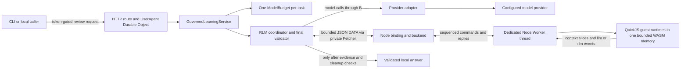

# How this fork works: bounded analysis without new authority

This describes the independent, opt-in local implementation. See [benchmark scope](BENCHMARKS.md), [AI AI-assistance disclosure](DEVELOPMENT.md), and [review guide](REVIEW_GUIDE.md). This is not an official upstream release.

## 1. What exists upstream, and what this fork adds

[Upstream Habenula](https://github.com/habenula-ai/habenula-oss) provides the personal-agent control harness: deterministic tool governance, credential custody, a verifiable audit chain, service integrations, ordinary agent execution, and CLI/MCP surfaces. Those are not inventions of this fork. The supplied `original` checkout is the comparison baseline, not a claim about every later upstream version.

The fork adds a bounded correspondence-review workflow, versioned/approved workflow guidance, four explicit analysis modes, and an optional local RLM path. “RLM” here means generated JavaScript can inspect a separately stored snapshot and request bounded model subtasks. It does **not** mean unlimited recursion, weight training, or permission to act on services.

The user-facing result is a `CommitmentLedger`: commitments, exact source spans, uncertainty, and optional reply **text**. It is not a saved draft or a send operation. Keep three different records straight:

1. Upstream **audit log**: records governed actions and control transitions.
2. **ModelBudget attempt ledger**: accounts for model admissions, usage, and settlement.
3. **CommitmentLedger**: the analysis answer, still subject to host validation.

Start with [the output contract](../packages/contracts/src/workflows.ts) and [the service](../packages/engine/src/workflows/service.ts).

## 2. The trust and execution boundaries



- **Durable Object (DO):** owns model access, the task budget, refinement pins, validation, and the final answer. These host capabilities are not serialized to the guest.
- **Private Node binding:** carries bounded DATA commands. It is not an external public backend endpoint and is not selected by request content.
- **Node Worker:** a separate JavaScript thread running a fixed trusted bootstrap. The application factory gives it `env: {}` and `execArgv: []`.
- **QuickJS guest:** evaluates generated code. The bootstrap exposes `contextMeta`, `contextSlice`, `llm`, `rlm`, and `input`, not Node/browser capabilities such as `process`, `require`, `fetch`, or `Buffer`. Module loading is removed.
- **Provider transport:** stays outside the guest and remains an external dependency. Local cancellation is not proof that remote inference or billing stopped.

The Worker bootstrap itself can load its packaged WASM asset through Node. “No guest file/network access” does not mean the trusted bootstrap has no host capabilities, nor that the design proves immunity to every VM/native-code bug.

Source path: [DO composition](../packages/engine/src/workflows/rlm-composition.ts) → [client](../packages/engine/src/workflows/rlm-backend-client.ts) → [binding](../packages/engine/src/daemon/rlm-binding.ts) → [backend](../packages/engine/src/rlm/node-backend.mjs) → [Worker](../packages/engine/src/rlm/worker.mjs). Wiring is in [the local factory](../packages/engine/src/daemon/rlm-host.ts).

## 3. Follow one task

### Admission and source identity

The service accepts a sealed snapshot or a registered synthetic fixture. The workflow does not acquire a live mailbox. The route checks the local caller token before parsing the body or looking up the owner. UserAgent checks its namespace identity. The service admits only one job at a time for that service/owner.

The host validates snapshot hashes and produces an answer-free source-offset index. Both ordinary and recursive modes use this aid. An active refinement, when requested, is pinned by immutable identity and rechecked across asynchronous work.

The service creates **one** `ModelBudget`. Only `rlm`/`both` add a native-operation scope. Root code generation, every child request, synthesis, and a possible repair all use that same budget. Creating a separate budget per child would let recursion bypass the task limit.

See [route bounds](../packages/engine/src/routes/governed-learning.ts), [job and budget admission](../packages/engine/src/workflows/service.ts), and [snapshot/index/ledger checks](../packages/engine/src/workflows/commitment-handoff.ts).

### Store the context, then generate code

The codec serializes `{snapshot, sourceIndex}` and packs it into NDJSON rows shaped `{i,c}`. Row `c` values are pieces of that serialized envelope, **not one message per row**. It preserves the original source and binds the packed context to a SHA-256 identity. A slice is bounded by both row count and UTF-8 bytes; asking for 64 rows does not guarantee they fit.

The coordinator opens a fresh backend task and initializes it exactly once. Its first model turn receives metadata/index and the codegen contract, not all message bodies. The reply must be exactly `{"rlmCode":1,"source":"<javascript>"}`. A normal answer JSON object is rejected; it is not relabelled as RLM.

A valid small-context retrieval expression, documented in the current prompt, is:

```js
(() => {
  const { records } = JSON.parse(contextMeta());
  let text = "";
  for (let i = 0; i < records; i++) {
    text += JSON.parse(contextSlice(i, 1)).c;
  }
  const { snapshot } = JSON.parse(text);
  return JSON.stringify({ snapshot });
})()
```

This example is for inputs whose returned payload fits the guest-output cap. It is not an instruction to reconstruct and return arbitrarily large inputs. The current small-context prompt recommends it when the envelope is at most 8,192 bytes. Code is still parsed, executed, and checked; it is not a host shortcut around execution.

See [the codec](../packages/engine/src/workflows/rlm-context-codec.ts) and [the current prompt contract](../packages/engine/src/workflows/rlm-prompts.ts).

### Root and child are logical roles, not OS processes

The application permits at most **three guest requests at depth one**. A run can use zero children.

- `llm(prompt)` requests a bounded text answer from a child model call. It does not need another generated guest program.
- `rlm(prompt)` requests a child code envelope. The host parses the envelope and sends only the source back; the Worker creates a child QuickJS runtime/context.
- Child programs cannot delegate again under this application policy.
- The coordinator consumes events returned by `evaluate`, `resolve`, and `pump`. It validates event/run/node identity and parent lineage before dispatch.
- The coordinator currently awaits child model requests sequentially. The budget's concurrency ceiling of two does not make this a two-way parallel scheduler.

A child QuickJS runtime is **not** another Node Worker and is not another AI development agent. Root and child guest runtimes share one WASM memory instance in the task Worker. The Node backend admits one active session per daemon process through a module-global permit.

See [the actual event loop](../packages/engine/src/workflows/rlm-runtime.ts) and [the application limits](../packages/engine/src/workflows/rlm-trace.ts).

### Source access is observed, not self-reported

The trusted Worker records successful context delivery and executed-source hashes in `metrics.readEvidence` version 2. The bridge validates its DATA shape and cumulative history. The coordinator checks code hashes against submitted source and verifies coverage of every packed row.

`utf8Bytes` and `returnedChars` are different measurements. The latter counts UTF-16 code units, matching source offsets; it is not calculated by converting byte totals. Missing, regressing, or truncated evidence cannot establish successful source access.

This proves bounded delivery/execution observations within the trusted host. It does **not** prove the model understood the source, found every commitment, or made a semantically correct inference. Final citation checks can establish exact spans, not entailment.

See [the telemetry producer](../packages/engine/src/rlm/read-evidence.mjs), [wire validation](../packages/engine/src/rlm/protocol.mjs), and [coverage/hash consumption](../packages/engine/src/workflows/rlm-runtime.ts).

### Synthesize, validate, then finish safely

The guest returns bounded findings, which may include retrieved source excerpts. Node's `publish(findings)` only accepts that guest completion; it does not publish the user-facing commitment ledger. A separate root model turn synthesizes the final ledger. The host allows at most one output-contract repair.

Completion requires contract-valid output, complete usage accounting, sufficient host evidence, and proven lifecycle cleanup. `runCommitmentWorkflow` refuses to qualify output when the RLM trace is missing or non-complete.

```mermaid
sequenceDiagram
    participant C as DO coordinator
    participant B as ModelBudget/native scope
    participant N as Node backend
    participant W as Worker
    C->>B: Cancel active work if needed; seal new admissions
    C->>N: terminate(reason)
    N->>W: request termination
    C->>N: waitExit()
    W-->>N: actual exit event
    C->>N: fresh inspect
    C->>B: join actual native operations
    C->>N: settle verified event debt; fresh inspect
    C->>N: release permit only if all facts agree
```

A public promise can reject before the underlying fetch/read/cancel work settles. The native scope tracks those operations and open producers, not just the outer model promise. If native work remains pending, the coordinator can return failure while retaining the permit and attach a later join/recheck. Unknown observation does not become proof of settlement because a timeout elapsed.

Keep two predicates separate:

- **May return a complete answer?** Requires output/evidence/usage/refinement checks plus successful finalization.
- **May release resources?** Requires actual Worker exit, settled native/provider work, no active calls, and settled guest-event debt. Unknown billing usage alone is not proof of a still-running native operation.

See [native tracking](../packages/engine/src/llm/native-operation-scope.ts), [bounded read/cancel tracking](../packages/engine/src/llm/bounded-response.ts), [finalize/releaseAfterJoin](../packages/engine/src/workflows/rlm-runtime.ts), and [final workflow classification](../packages/engine/src/workflows/run-workflow.ts).

## 4. Real bounds: do not mix layers

These are current source defaults/enforced application selections, not measured performance or universal input-fit guarantees. Source can refuse earlier due to another bound.

| Layer | Current value | Meaning |
|---|---:|---|
| Snapshot | 32 messages; 12,000 UTF-16 units/body; 96,000 total body units | Schema bounds, not bytes/tokens |
| Final ledger | 12 items; up to 6 current and 6 prior evidence spans/item | Output schema |
| App guest requests/depth | 3 / 1 | Combined `llm` and `rlm` events |
| Guest VMs | 4 total; 3 simultaneously live | App total; primitive live cap, within one Worker |
| Model budget | 10 attempts; concurrency 2 | Shared across all roles; not ten guest children |
| Model requests | 512 KiB input/call; 2 MiB aggregate | Host request accounting |
| Model usage defaults | 120,000 observed input; 12,000 observed output tokens | Usage/accounting guards, not a remote billing guarantee |
| Requested output/response | 4,096 tokens/call; 256 KiB response/call | Requested token ceiling vs local bounded response bytes |
| Workflow HTTP body | 1 MiB | Entry-route byte cap; not a model-context allowance |
| Private DATA wire | 64 KiB ordinary; 18 MiB + 16 KiB init | Larger init ceiling handles serialized packed context |
| Context store/slice | 3 MiB packed store; at most 64 rows **and** 20,000 UTF-8 bytes/slice | JSON/NDJSON representation, not raw body size |
| Context reads/transfer | 256 reads; 4 MiB transferred | Guest bridge caps |
| Child prompts | 4,096 bytes each; 8,192 aggregate | UTF-8, not tokens or JS `.length` |
| Generated code | 32,768 bytes root; 8,192 bytes child | Distinct evaluate vs resolve channels |
| Guest completion | 8,192 bytes | Findings/source payload, not an arbitrary ledger dump |
| WASM memory | 16 MiB initial; 32 MiB maximum | Shared imported linear memory; **not** whole-process RSS |
| QuickJS stack | 262,144 bytes/runtime | Configured QuickJS stack limit |
| Time | 300 s model-budget wall time and backend lifetime; 2 s startup | Separate lifecycle clocks |
| Active commands | 100 ms/command; 8,000 ms cumulative | Command time; waiting for model responses is not charged as guest command execution |
| Native tracking | 64 pending operations; 16 open transports; 16 join waiters | Separate bookkeeping/admission caps |
| Evidence/control | 64 trace operations; 128 coordinator continuation steps | Separate from primitive 1,200-command cap |

Sources: [schema](../packages/contracts/src/workflows.ts), [budget](../packages/engine/src/workflows/model-budget.ts), [app trace policy](../packages/engine/src/workflows/rlm-trace.ts), [primitive limits](../packages/engine/src/rlm/protocol.mjs), [timing](../packages/engine/src/rlm/timing-policy.mjs), [memory/stack](../packages/engine/src/rlm/worker.mjs).

The protocol also contains larger primitive ceilings and an explicitly unaccepted `PRODUCTION_POLICY` object. Do not quote those as the selected application policy: follow the coordinator's `backend.open(...limits)` call. These limits do not guarantee all schema-valid inputs fit every later representation or evidence cap.

## 5. Refinements are guidance, not permissions

The four modes are `baseline`, `refinements`, `rlm`, and `both`. The latter combines RLM with an eligible active refinement. Refinements are bounded versioned guidance with provenance, validation, exact-version approval, activation, disable, and rollback. They are not executable plugins, model-weight updates, or new grants.

Qualification distinguishes `schema_contract`, `deterministic_mock`, and `real_model`; those labels cannot be treated as interchangeable efficacy evidence. Scope-generation/pin checks prevent a late run from accepting a disabled or replaced refinement. Management routes are local caller-token controls, not tools exposed to the model.

See [refinement contracts](../packages/contracts/src/refinements.ts), [lifecycle manager](../packages/engine/src/refinements/manager.ts), and [trusted qualification selection](../packages/engine/src/workflows/service.ts).

## 6. Local deployment and what has actually been shown

Use the normal compiled Node daemon with existing encryption-key, local token, and provider configuration. Enable `GOVERNED_LEARNING=true` and `GOVERNED_RLM=true`. The daemon supplies `RLM_BACKEND` privately; an environment string or request is not a replacement. From the repository root, use `node packages/cli/dist/index.js review snapshot.json --mode rlm`; `both` needs eligible active guidance. Standalone Wrangler has no private Node backend and refuses RLM rather than silently running baseline.

The stager includes five runtime MJS files, three declaration sidecars, 15 hash-pinned QuickJS 0.31.0 files, and license notices in a private runtime layout using package-relative resolution. Emitted daemon declarations are needed by the staged backend's declaration imports; source typechecking alone cannot prove a packaged consumer resolves.

The current repair receipt records **one** true live-model `fresh-05` run: **230,274 ms**, **8/8 authored synthetic checks**, **two root model calls, zero child calls**, guest execution/context reads, and local cleanup. Separate [staged verification](../evidence/verification.json) records 59 native tests, 1,168 engine tests, the source build, and the compiled-daemon/API fixture. This documentation pass ran none of those checks.

That result is not a benchmark winner, proof of semantic correctness, live recursive-child success, verified billing, or general efficacy. The old comparison stopped after 4 of 12 planned rows. The repair case is not an extra row in that cohort. The separately frozen [fresh comparison](BENCHMARKS.md) is reported without pooling those old observations. [Development accounting](DEVELOPMENT.md) separates recorded categories and missing usage.

Source/evidence: [local opt-in instructions](../packages/engine/README.md), [stager](../packages/engine/scripts/stage-rlm-runtime.mjs), [repair case study](REPAIR.md).

## 7. Security and the lesson worth defending

This remains an early-alpha, loopback-only system without general user authentication. A local shared caller token does not establish per-user identity or human presence. Host/Origin checks are defense-in-depth, not a safe public-network deployment boundary. Do not imply prompt-injection immunity, an independent security audit, or cancellation of remote effects. Preserve upstream's [security limitations](../packages/engine/SECURITY.md) and notices.

**Architecture lesson:** separate proposed computation from authority, observed evidence from self-report, and answer acceptance from resource cleanup. Then test the joins between those pieces. A green component test, a source build, a packaged consumer, a real daemon run, and a live-provider case establish different facts.
