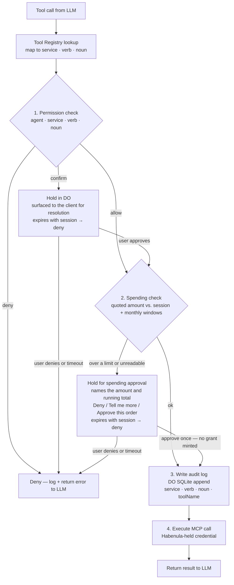
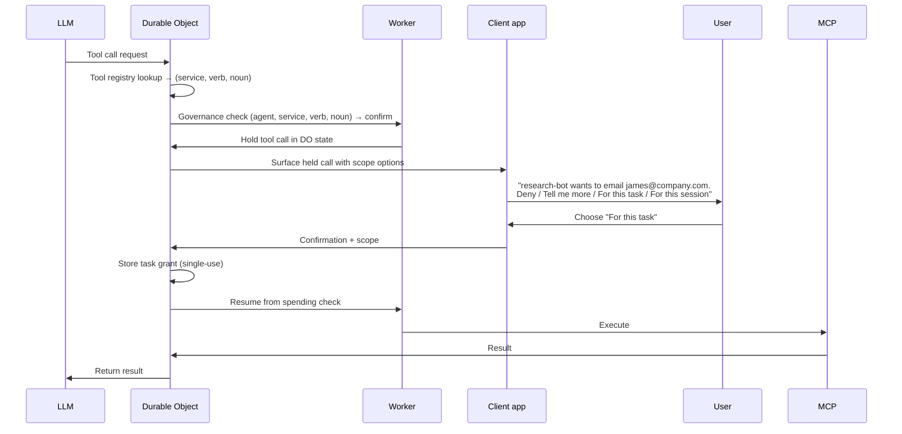

# Governance and Permissions

The governance layer intercepts every tool call the LLM requests and makes a deterministic decision before any tool executes — `allow`, `deny`, or `pending` (hold the call and ask the user). No LLM involved in the decision. See the §Pending and held calls section for the confirmation flow.

## Accountable Agents

Each named agent is a sandboxed runtime — an accountable agent. It has:

- **Process isolation:** Its own session state within the user's Durable Object
- **Scoped permissions:** Only the services, verbs, and nouns explicitly granted in its policy
- **No implicit access:** An agent with no policy has no permissions. Access is additive, never inherited.

The accountable agent model maps directly to OS process isolation: a process can only access files and resources it has permissions for. An agent can only apply verbs to nouns it has been explicitly granted.

## Verb-Noun Permission Model

Permissions are `(agent, service, verb, noun) → PolicyDecision` tuples. The governance function never sees raw MCP tool names — it operates on abstract verbs and concrete nouns.

### Verb Vocabulary

Habenula defines a small, stable set of canonical verbs. New verbs require a deliberate revision to the canonical set.

| Verb | Meaning | Examples |
|------|---------|---------|
| `read` | Retrieve data without modification | Read inbox, list files, get calendar events |
| `write` | Create or modify data | Edit a document, update a contact |
| `send` | Transmit a message or notification | Send email, post to Slack, send Telegram message |
| `delete` | Remove data | Delete email, remove file, cancel event |
| `create` | Create a new resource | Create calendar event, create document, create channel |
| `list` | Enumerate resources | List files in directory, list calendar events, list channels |
| `execute` | Run an operation with side effects | Run browser action, execute web search |
| `delegate` | Spawn a child agent with declared scope | Spawn a sub-agent to triage inbox, delegate Drive writes to a child agent (future feature) |

### Noun Types

Nouns are service-specific and matched **exactly** (case-insensitive) as literal strings. Type-appropriate matching — domain globs (`*@company.com`), path globs (`/research/**`), channel prefixes (`eng-*`) — is the designed direction and is **not built**; every noun below is compared as a literal string.

| Service | Noun Type | Matching |
|---------|-----------|----------|
| Gmail | Mailbox label, recipient address | Exact match |
| Outlook Mail | Mailbox label, recipient address | Exact match |
| Google Calendar | Calendar name, invitee domain | Exact match |
| Slack | Channel name | Exact match |
| GitHub | Repository owner | Exact match |

Drive, the sandboxed file system, headless Chromium, and web search are not yet integrated, so they have no noun on `main`.

### Modifiers: Adverbs and Adjectives

Verbs and nouns carry modifiers that constrain how and where they apply. In the designed policy language they are first-class — part of the permission tuple, not configuration options. **None of the modifiers below is built in this release:** a policy entry today is a bare `(service, verb, noun) → allow | deny` at a priority, with no modifier slot.

**Adverbs** (modify the verb — how the action is performed):

| Adverb | Effect |
|--------|--------|
| `confirm` | Escalate to user before executing |
| `deny` | Never execute |
| `rate_limit` | Execute at most N per interval |
| `daily_limit` | Execute at most N per day |
| `active_hours` | Execute only during specified hours |
| `confirm_above_usd` | Escalate if estimated cost exceeds threshold |

**Adjectives** (modify the noun — which resources the verb applies to):

| Example | Effect |
|---------|--------|
| `nouns: ["*@company.com"]` | Only internal recipients |
| `nouns: ["/research/**"]` | Only this directory tree |
| `nouns: ["eng-*"]` | Only engineering channels |
| `nouns: ["primary"]` | Only the primary calendar |

That designed tuple is `(agent, service, verb+adverbs, noun+adjectives)`; the evaluator compares `(service, verb, noun)` today.

## Tool Registry

The tool registry is a Habenula-owned mapping from MCP tool names to `(service, verb, nounExtractor)` tuples. Habenula authors all mappings.

```
Tool Registry (Habenula-owned, authoritative):
┌─────────────────────────┬─────────┬────────┬───────────────┐
│ mcp_tool_name           │ service │ verb   │ noun_param    │
├─────────────────────────┼─────────┼────────┼───────────────┤
│ gmail_send_email        │ gmail   │ send   │ params.to     │
│ gmail_read_inbox        │ gmail   │ read   │ params.label  │
│ gmail_list_messages     │ gmail   │ list   │ params.label  │
│ gmail_delete_message    │ gmail   │ delete │ params.id     │
│ drive_read_file         │ drive   │ read   │ params.path   │
│ drive_write_file        │ drive   │ write  │ params.path   │
│ drive_list_files        │ drive   │ list   │ params.folder  │
│ slack_post_message      │ slack   │ send   │ params.channel│
│ slack_read_channel      │ slack   │ read   │ params.channel│
│ calendar_create_event   │ calendar│ create │ params.calendar│
│ calendar_list_events    │ calendar│ list   │ params.calendar│
│ fs_read                 │ fs      │ read   │ params.path   │
│ fs_write                │ fs      │ write  │ params.path   │
│ browser_navigate        │ browser │ execute│ params.url    │
│ web_search              │ search  │ execute│ params.query  │
└─────────────────────────┴─────────┴────────┴───────────────┘
```

**Unregistered tools:** Any tool call that doesn't appear in the registry is classified as `(unknown_service, execute, confirm)` — safe but requires confirmation on every call. This is the fail-safe default, and it is what will apply to a third-party MCP server's tools when that outbound path ships, before Habenula authors the mapping.

## Pipeline



A spending breach asks rather than blocks: it resolves to the same hold machinery a permission confirmation uses, with a restricted answer set — Deny, Tell me more, or approve this one order. Approving mints no grant and raises no ceiling; the next over-cap order asks again. The check prices the call from its bound quote (the service commits to the total before anything is charged) and reads both windows — per-session and per-month — as sums over a spend ledger, so lowering a cap binds the very next call. When the ledger cannot be read, the call holds and says so, never silently allowing or hard-denying.

### Execution preconditions

Three checks run in `executeTool` before policy is queried, each short-circuiting to a plain deny (`entries: []`, no hold) that is audited with the same `(service, verb, noun)` a permitted call would carry. The first is the trust boundary. The other two carry distinct `denyReason`s, because the user's remediation differs:

- **the two-surface boundary** — the run's surface may not reach Habenula's control plane, and its model named a `habenula` tool anyway. This one runs first, because nothing about it is contingent: it does not depend on connection state, scopes, policy or spend. It carries **no** `denyReason`, because that vocabulary is the set of remediations a caller can act on and this refusal has none. It reports the distinct `boundary_refused` tool-call outcome instead, so no client offers the user a grant the engine must never accept. See `inbound-mcp.md`.
- **`not_connected`** — the tool's service holds no connection. Fix: connect the service.
- **`needs_authorization`** — the service is connected, but the stored credential's *actually granted* OAuth scopes don't cover the tool's declared capability (`Tool.requiredScopes`). Coverage is any-of, not exact-string: a broader scope (`gmail.modify`, or the umbrella `https://mail.google.com/`) satisfies a narrower capability (read). Reading granted scopes requires decrypting the credential blob, so this precondition adds one decrypt-only credential read per governed call on a scope-declaring tool. Fix: re-connect the service to grant the wider scope (out of band — `habenula connect <service>`).

A connected service whose credential is missing or unreadable **skips** the scope gate — that state is not a scope gap, and dispatch-time credential resolution owns the failure. One consequence: with no matching grant, such a call still reaches policy and can be held; if the user confirms it, the call then fails at dispatch. The confirmation is honest (the user approved the action), but it cannot make the call succeed.

None of the three is structurally queryable in the audit log: all are written as `decision = deny`, `outcome = error`, distinguishable only by `error_message`. The distinct labels ride the return path (`DenyReason`, and the conversation loop's `ToolCallOutcome`) so clients and the model narrate the right fix.

## Permission Model

Three levels of expressiveness, surfaced progressively in the UI. **Every verb grant requires a noun binding.** No bare verb grants — a verb without a noun scope is incomplete and functionally equivalent to deny. This maps to OS file permissions: a process doesn't get "write" globally, it gets write to specific paths. No path = no access.

### Level 1 — Service Connection

```yaml
services:
  gmail: connected
  slack: connected
  drive: disconnected
```

Service connection is **not a permission grant**. It establishes the OAuth credential so the service is available. Connecting Gmail doesn't allow any agent to do anything — it means Habenula holds a Gmail token. Verb and noun grants are separate.

### Level 2 — Verb + Noun Grants

Every verb requires a noun scope. In this release, grants are minted through held-call confirmation — **For this task** or **For this session**, each carrying the held call's noun binding. A settings surface for standing verb + noun grants is planned; nothing in this release mints a grant outside the confirmation flow.

```yaml
agents:
  research-bot:
    services:
      gmail:
        list:
          nouns: ["INBOX"]               # one mailbox, named exactly
        send:
          nouns: ["alice@example.com"]   # one exact recipient
        trash: deny
      slack:
        read:
          nouns: ["eng-platform"]        # one channel, named exactly
      google_calendar:
        read:
          nouns: ["primary"]
```

### Level 3 — Full Policy with Modifiers (Adverbs + Adjectives)

**Nothing in this section is built — read it as the destination for the policy language.** A wildcard `allow` is not part of that destination either: the evaluator honors `*` only on a deny, so breadth is always an enumeration or a pattern, never `*`.

```yaml
version: 1
agents:
  research-bot:
    services:
      gmail:
        list:
          nouns: ["INBOX", "STARRED"]
          rate_limit: 100/hour            # adverb: how fast
        send:
          nouns: ["*@company.com"]        # adjective: which recipients
          confirm: ["!@company.com"]      # adverb: confirm external sends
          daily_limit: 20                 # adverb: how many per day
        delete: deny
      drive:
        read:
          nouns: ["/research/**"]
        write:
          nouns: ["/research/output/**"]
        delete: deny
      slack:
        read:
          nouns: ["eng-*", "research-*"]
        send:
          nouns: ["eng-*"]
          confirm: true                   # adverb: confirm all sends
      fs:
        read:
          nouns: ["/data/research/**"]
        write:
          nouns: ["/data/research/output/**"]
    spending:
      monthly_limit_usd: 50
      session_limit_usd: 20              # per-session window; a runaway agent hits this long before the month ends
      per_transaction_limit_usd: 10
      confirm_above_usd: 5               # adverb: escalate above threshold
    time_restrictions:
      active_hours: "08:00-22:00"         # adverb: when allowed
      timezone: "America/New_York"

  personal-assistant:
    services:
      gmail:
        list:
          nouns: ["INBOX"]
        send:
          nouns: ["*@company.com", "*@partner.example"]
          confirm: true
        delete: deny
      calendar:
        read:
          nouns: ["primary"]
        create:
          nouns: ["primary"]
        delete: deny
    spending:
      monthly_limit_usd: 25
```

Policy stored in DO built-in SQLite, validated before apply.

## Governance Function

```typescript
interface PolicyAction {
  agent:    string;
  service:  string;
  verb:     string;
  noun:     string;
  toolName: string;                 // preserved for audit log
  params:   Record<string, unknown>; // full params for condition evaluation
}

interface PolicyEntry {
  id:        string;
  source:    "session" | "task" | "standing";
  sessionId?: string;
  service:   string;
  verb:      string;
  noun:      string;
  decision:  "allow" | "deny";
  priority:  number;
  createdAt: string;
  expiresAt?: string;
}

interface PolicyDecision {
  decision: "allow" | "deny";
  source:   string;
  entryId?: string;
}

evaluatePolicy(entries: PolicyEntry[], action: PolicyAction): PolicyDecision
```

Still a pure function. No side effects, no database calls, no network calls. Independently testable. The raw MCP tool name is preserved for the audit log but the governance decision is made on `(agent, service, verb, noun)`.

### Policy Storage

Policy entries are stored in a single `policy_entries` table in DO SQLite. The table replaces the previous dual-table design (`policy_overrides` + `user_settings.default_policy`):

```sql
CREATE TABLE IF NOT EXISTS policy_entries (
  id          TEXT PRIMARY KEY,
  source      TEXT NOT NULL CHECK(source IN ('session', 'task', 'standing')),
  session_id  TEXT,
  service     TEXT NOT NULL,
  verb        TEXT NOT NULL,
  noun        TEXT NOT NULL,
  decision    TEXT NOT NULL CHECK(decision IN ('allow', 'deny')),  -- no DEFAULT: omitting decision must fail closed, not default to 'allow'
  priority    INTEGER NOT NULL DEFAULT 0 CHECK(priority IS NOT NULL),  -- 2nd storage guard against a null priority (primary guard: evaluate-policy.ts denies outright on a non-finite priority)
  created_at  TEXT NOT NULL,
  expires_at  TEXT,
  consumed_at TEXT    -- single-use ("For this task") grants: inert once set
);

-- Wildcard deny (priority 0) seeded on every DO creation:
-- the only wildcard row that may exist. Ensures deny is the default.
INSERT OR IGNORE INTO policy_entries (id, source, service, verb, noun, decision, priority, created_at)
VALUES ('default-deny', 'standing', '*', '*', '*', 'deny', 0, datetime('now'));
```

`queryPolicyEntries()` fetches all matching, live (non-expired, non-consumed) entries and the pure `evaluatePolicy()` function sorts by priority descending, first match wins.

**No permanent-allow surface exists.** The only standing entry is `'default-deny'`. There is no standing-allow row, and the evaluator honors a wildcard `*` only for a `deny` entry — an allow entry carrying `*` in any position can never match. Grants are created exclusively by the confirmation flow and are always session- or task-scoped with auto-generated IDs. A **task grant** is single-use: its `consumed_at` is set (committed before the tool executes) the instant it authorizes its one call, and the evaluator excludes consumed rows at read time, so it is inert thereafter even if a DO eviction strands the row before deletion.

## Confirmation-as-Onboarding

Users build noun grants organically through use, not upfront YAML configuration. When an agent encounters a tool it needs and lacks a grant, the governance pipeline holds the call with a `pending` decision (§Pending and held calls below) and asks the user. The user picks one of four choices (a **spending** hold offers three: Deny, Tell me more, and Approve this order — it mints no grant, so the two grant answers do not apply):

| Choice | Effect | Lifetime |
|-------|--------|----------|
| **Deny** | Single-use refusal, no grant created | This action only |
| **Tell me more** | Returns the tool's registry metadata; the call stays parked | — (no decision yet) |
| **For this task** | Single-use grant, consumed the instant it authorizes its one call | One call (`consumed_at`) |
| **For this session** | Session-scoped grant | Until the session ends (`started_at + 90 min`) |

**No permanent ("Always") grant exists in the current release** — the strongest grant is session-scoped, and the kill switch wipes them all. This is the correct trust curve: a new agent with no track record requires approval for novel actions. (A permanent-grant tier is a possible later addition, out of scope for the current release.)

### Pending and held calls

When evaluation finds no affirmative grant for an action (only the `default-deny` floor matches, or nothing matches), the pipeline does not hard-deny — it returns `pending` and **holds** the call. The decision to hold is made by the pipeline, not inside `evaluatePolicy()`, which stays a pure function (Hard Invariant 2).

Holding records and parks the in-flight turn so it can resume after the user decides:

- The `pending` decision is written to the audit log **before** the call is held (audit-before-execute, Hard Invariant 3).
- A `held_tool_calls` row persists the whole in-flight turn state (the conversation up to the hold, the held tool call and its parked parameters, any sibling tool calls parked behind it, the results already produced this turn, and the loop's remaining iteration budget) to DO SQLite — so a held call survives DO hibernation. The held call is never returned to the LLM (Hard Invariant 1 trust boundary preserved).
- **One held call per task.** The human conversation never parks a second call while one waits — the chat path refuses the turn and hands back the existing hold. Separate tasks (each commissioned run) can each park their own, so several held calls can coexist on one DO. The status read (`GET /api/status`) lists every call awaiting a decision, oldest first — a parked call is never hidden behind another.

`resolveConfirmation(choice)` resolves it. "Tell me more" returns the registry metadata block and leaves the call parked. "Deny" resolves to a denied outcome (the LLM sees only the fixed string "Denied by user"). "For this task" / "For this session" mint the scoped grant, dispatch the parked call (the parked parameters, never anything supplied at resolve time), and re-invoke the conversation loop to continue the turn. Resume is **re-entry**, not a paused coroutine: the loop is started fresh with the persisted turn state as the authoritative record.

**Lifetime and expiry.** A held call has no clock of its own — it lives and dies with its session, whose lifetime is `started_at + 90 min` (the single session clock; every session grant shares that one anchor). Expiry is enforced at read time: past the cap a held call is inert (it cannot authorize or resume). There is no alarm. The durable terminal records — the held call's denied outcome (resolving its `pending` entry) and a `session.end` audit event — are written lazily on the next DO activity that observes the session expired, or eagerly on kill, both stamped with the effective expiry instant. A fully abandoned session with no held call leaves its records until the DO is next active (accepted residual in the current release).

**Interruption recovery.** Approving a call commits two facts, in order: that the tool was dispatched, then the result it produced. If the engine stops between them, the call ran but its result is lost. Recovery never dispatches the tool a second time. Habenula closes the call's open decision entry with the outcome recorded as unknown, and tells the agent the call completed without a result. Two paths reach that recovery: a retried confirmation, and the next message in the conversation. The second path is what keeps the conversation usable. Such a call is no longer waiting for a decision, so `status` correctly shows nothing to confirm — and nothing would tell the user to retry a confirmation. The interrupted call clears itself on the next message instead of blocking every message after it.

**Plan compilation** mitigates cold-start friction for multi-step tasks. The LLM produces a structured plan with declared noun scopes, and the governance layer presents it as one scoped confirmation: *"research-bot wants to read 10 emails from competitor domains, draft replies to important ones, and label the rest. Approve for this task?"* See the Plan Compilation section below for the full design.

**Scope suggestions** are planned, not built: they would help users build grants at the right granularity, so that approving a read from john@competitor.com could offer *"Also approve emails from \*@competitor.com?"* The offer is meaningful only once a noun can name a set, so it lands with patterned matching.

### Confirmation UX

Held-call prompts carry **visual severity encoding** in the client design — appearance (color, icon, urgency level) communicates risk at a glance:

| Severity | Visual | Trigger |
|----------|--------|---------|
| Low | Neutral | Read operations, listing, low-cost actions |
| Medium | Caution | Send/write operations, moderate cost |
| High | Alert | Delete operations, financial transactions, bulk operations |
| Critical | Urgent | Actions above spending threshold, first use of destructive verbs |

Responses are not binary. Beyond **Deny** and the two grant answers (**For this task** / **For this session**), the user can respond with **"Tell me more"** — this expands the held call into a detailed view showing: the agent's reasoning (what it's trying to accomplish), the specific parameters of the tool call, the noun scope being requested, the estimated cost, alternative scope options (narrower or broader), and the agent's recent action history. The detailed view lets the user make an informed decision rather than a reflexive yes/no.

### Confirmation Flow



Confirmations are stored in the DO. A held call expires when its session ends — anchored to the single 90-minute session clock and swept by a lazy reaper on the next DO activity, not a dedicated alarm. In this release the client surfaces held calls when it polls or the user interacts; push-notification delivery (APNs/FCM) is planned.

### Organizer Agent Pattern

A dedicated organizer agent bootstraps the noun taxonomy that makes fine-grained scoping usable. This is a design pattern, not a shipped configuration — it depends on the per-agent policy dimension and label-write verbs, neither of which is built:

```yaml
organizer:
  services:
    gmail:
      read:
        nouns: ["INBOX", "STARRED", "IMPORTANT"]  # every mailbox it must sort
      write:
        nouns: ["labels/*"]                       # can create and apply labels only
      send: deny
      delete: deny
```

High-read, narrow-write, zero-send/delete. It builds the label/folder structure that other agents' governance can match against. For example, once the organizer creates a "competitor-updates" label, a research agent can be granted `read: nouns: ["label:competitor-updates"]` — concrete, deterministic, no semantic evaluation required. Natural Habenula Store template.

## Heartbeat / Dead Man's Switch

The current release runs a single 90-minute session clock; session-scoped grants and held calls expire when it ends. The configurable, per-agent heartbeat described here is the model this generalizes into with the multi-agent split. In that model, agent sessions have a configurable heartbeat interval, and at each interval the agent proposes termination via push notification:

*"research-bot has been running for 30 minutes and has read 47 emails. [Continue 30m / Continue 2h / Stop]"*

No response within a timeout → agent stops. Session-scoped noun grants expire with the session.

This ensures:
- **No agent runs forever** without explicit renewal
- **Session-scoped grants have a natural lifetime** — the session IS the temporal bound
- **Users get periodic visibility** — the heartbeat is a micro-digest (actions taken, resources accessed, cost accumulated)
- **Long-running agents use longer intervals** — inbox monitors might use 24-hour heartbeats; task agents use 30 minutes
- **Cost surfaces naturally** — accumulated spending is shown at each heartbeat

Default intervals (configurable per agent):
- Task agents: 30 minutes
- Long-running monitors: 24 hours
- User can modify the interval at each heartbeat prompt

Implementation: DO alarms fire the heartbeat. Push notification sent. If no renewal arrives within the timeout, the coordinator kills the agent's worker DO and expires session-scoped grants.

## Kill Switch

**In the current release, kill is deny-all.** `habenula kill` executes atomically within the user's DO, in one `transactionSync`:

1. Delete every `policy_entries` row except the `default-deny` floor (so the agent returns to deny-by-default).
2. Sweep every held call, and for each write its terminal denied outcome (resolving the open `pending` audit entry) plus a `session.end` audit event (reason `kill`).

Connected services and their stored credentials **survive a kill** — they are not deleted. With deny-all in force, the policy floor denies every action, so a still-valid OAuth credential is unusable without a grant, and there are no grants. Preserving the connections means the user resumes after a kill without re-running OAuth. **Token revocation and live MCP-connection termination are deliberately deferred to a later release** (defense-in-depth, not what makes kill safe today). Scoped per-agent kill is also a later release (today, `habenula kill` stops all agents).

Propagates within a single Cloudflare edge request — typically <50ms globally.

## Default Confirmation Triggers

These trigger confirmation regardless of user policy:

- Any verb+noun combination the agent lacks a grant for (confirmation-as-onboarding)
- Any action by an agent on a service it has not previously accessed
- Any financial transaction above the user's threshold
- Any bulk operation (> N items affected; N configurable)
- Any action flagged as anomalous by behavioral heuristics
- Any action the user has explicitly marked as confirm
- Any unregistered tool call (tool not in the Habenula tool registry)
- Any tool call where the noun could not be extracted from parameters

## Implementation Notes

- Permission evaluation is a pure function: `evaluatePolicy(entries: PolicyEntry[], action: PolicyAction) → PolicyDecision`. No side effects. Independently testable.
- Tool registry lookup happens before governance evaluation — it is a separate step, not part of `evaluatePolicy()`.
- Policy stored in DO SQLite; loaded on DO activation.
- Spending is an append-only ledger in DO SQLite, summed per window (rate-limit counters are future work) (strongly consistent within the session). KV is not used for counters due to eventual consistency and 1 write/sec/key limit — see `docs/footguns.md`.
- Audit log write happens before tool execution and records `service`, `verb`, `noun`, and `toolName` separately. If the tool call fails, the entry records the failure. No automatic retries.
- **Semantic scoping is not deterministic.** The governance function cannot evaluate "research-related reads" — that's a semantic judgment the LLM cannot be trusted to make. Task scoping must be expressed through concrete nouns: specific email addresses, labels, file paths, channel names. The mapping from user intent to concrete nouns happens through: (1) LLM proposes, user approves specific noun access; (2) organizer agents sort data into labels/folders, creating concrete noun targets. A broad grant is not a third route — a wildcard allow never matches, so breadth is assembled from concrete nouns however wide the eventual scope.
- **Unextractable noun → confirm fallback.** If the tool registry cannot extract a noun from the tool call parameters (e.g., parameter missing or ambiguous), the governance function returns `confirm` rather than defaulting to allow. Safe, not permissive.

## Plan Compilation and Batch Governance

Multi-step agent tasks produce a **structured plan** before execution. The plan is a DAG of `(service, verb, noun_scope)` steps with declared dependencies. Plans are first-class governance artifacts — approved as a unit, recorded in the audit log, and used as the reference for execution-time governance.

### Why plans

Per-call confirmation works for simple interactions ("what are my unread emails?"). Multi-step tasks ("triage my inbox and draft replies to important emails") generate many tool calls whose noun scopes depend on each other. Per-call confirmation for these is exhausting (47 confirmations), and a wildcard allow is not an escape hatch — it never matches, so every distinct noun is its own question.

Plan compilation inserts a boundary between the LLM's stochastic planning and the governance pipeline's deterministic execution:

```
User intent → LLM planning (stochastic) → Structured plan → Batch governance approval (deterministic) → Execution
```

The plan is the permission request. The user sees one confirmation describing the full scope of action, not N individual tool-call confirmations.

### Derived noun scopes

Plans introduce a new noun extraction mode beyond literal param pool matching. A plan step can declare its noun scope as a **derivation from another step's output**:

```yaml
steps:
  - id: step_1
    service: gmail
    verb: read
    noun_scope: "label:inbox AND is:unread"
    output: emails[]

  - id: step_2
    service: gmail
    verb: send
    noun_scope:
      derived_from: step_1
      filter: "importance > high"
      field: "sender"
    depends_on: [step_1]
```

The specific email addresses for step 2 aren't known until step 1 executes. But the scope pattern — "send only to senders of important emails from step 1" — is declared upfront, approvable, and enforceable at resolution time. This is strictly more expressive than call-by-call noun extraction.

At execution time, derived scopes are resolved from actual step outputs by the plan executor (not the LLM), and each resolved noun is verified against the approved pattern.

### When plan compilation engages

Plan compilation is optional, not mandatory:

| Interaction type | Plan compilation? |
|-----------------|-------------------|
| Single tool call | No — per-call governance |
| Multi-step with literal nouns | No — per-call governance works |
| Multi-step with derived/conditional nouns | Yes |
| Long-running task | Yes — session scope needs plan-level approval |

Any tool call not in an approved plan falls back to per-call governance (existing behavior). Plans are a pre-approval for known steps, not a constraint on unplanned actions.

### Delegation as a plan step

Plans can include `type: delegate` steps that spawn child agents with declared scope. The parent agent proposes child scope; the user approves via plan-level confirmation. Child agents get their own worker DO and independent governance evaluation. The parent cannot grant its own permissions — the user is the authority. LLM-internal decomposition (invisible to Habenula) is bounded by the parent's grants; Habenula-governed delegation is for cases where the child needs different tool access.

### Plan-level confirmation

The user sees the full plan as one confirmation:

> **inbox-triager wants to:**
> - Read your unread inbox
> - Label non-important emails as "triaged"
> - Draft replies to important emails (you'll approve each draft)
>
> **Approve for this task?**  [Deny] [Tell me more] [For this task] [For this session]

This replaces smart batching as the solution for multi-step confirmation UX. See plan compilation research docs for the full analysis, including phased plans, conditional branches, and plan drift handling.

### Executor surfaces that are themselves LLMs

Plan compilation's guarantees — derived scopes resolved from typed outputs, multiplicity caps, taint tracking, `forbids` enforcement, preview/commit — assume the executor of each step is deterministic. They downgrade from structural to best-effort when a step is itself driven by an LLM (e.g., `browser.execute`, `computer.use`), because intra-step micro-decisions are not individually governed. The sharpest case is wire-level field binding for payment: a typed snapshot of a checkout page does not prove what gets submitted on click — JavaScript can rewrite form data, hidden fields can be tampered with, the form's `action` can retarget at the last moment.

Mitigations layer outward-to-inward: prefer structured tool surfaces when available, constrain the executor envelope (domain-pin, endpoint allowlist, forbids on the executor verbs), two-phase visual snapshot, wire-level POST interception in first-party browser MCPs, and the strongest layer — **payment-channel isolation** via platform-issued virtual cards or payment-aware MCP hand-off, where the card never enters executor scope at all. WebAuthn-bound commit signing (planned for the consumer release) and receipt reconciliation against the merchant's own confirmation channel close out the post-hoc layer.

Residual model-trust at execution time is irreducible for surfaces with no structured-API alternative.

### Audit integration

Each audit log entry includes a `plan_id` (nullable) linking it to the plan it belongs to. Plans themselves are recorded as audit artifacts with the approved scope and step structure. This creates a two-level audit trail: intent (the plan) and execution (individual actions).
