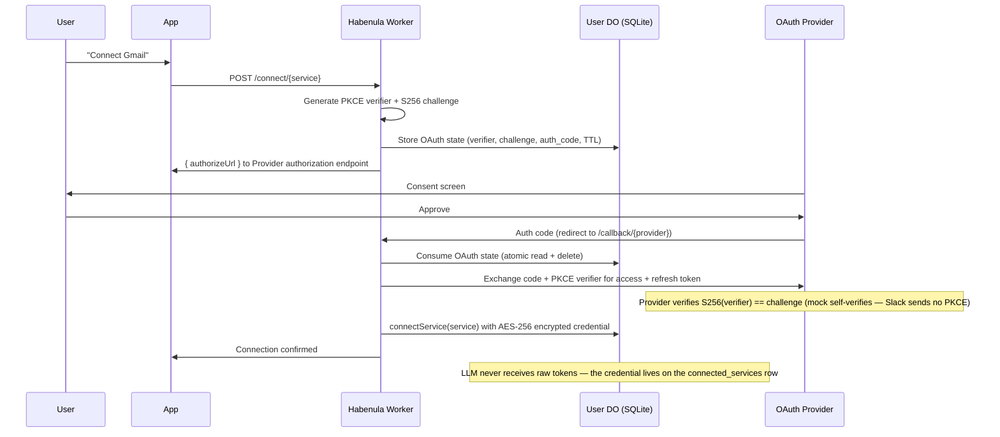
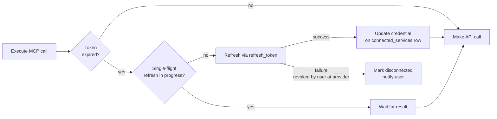

# OAuth and Credential Management

Habenula acts as the OAuth client for every connected service. The LLM never receives raw credentials. Establish this architecture before the first integration is built — it cannot be retrofitted.

## Connect Surface

A single `POST /connect/{service}` entry point handles every connection. It dispatches on the service catalog (`packages/tools/src/services/catalog.ts`), the single source of truth for which services exist and how they authenticate:

- **OAuth services** (e.g. `gmail`, `mock_email`) — the Worker generates PKCE + state and returns `{ authorizeUrl, flow }`; the client navigates the user to the provider's authorization endpoint and polls/cancels the pending flow by its `flow` handle (see Connect Flow Lifecycle below).
- **Credential-less services** (`auth: "none"`) — the Worker connects the service directly, no OAuth round-trip.
- **Unknown services** — `400`.

The service catalog is the single source of truth from which the tool registry and the credential refresh map are derived.

## Credential Flow



## OAuth State Management

OAuth state (PKCE verifier, code challenge, authorization code) is stored in the user's Durable Object SQLite, not KV. This gives strong consistency and atomic one-time consumption via `transactionSync()`.

**State key format:** The `state` parameter sent to the OAuth provider is `{userId}:{randomPart}`. The callback parses this to route to the correct user DO, then calls `consumeOAuthState(randomPart)` which atomically reads and deletes the state. This avoids any global lookup store. The `randomPart` doubles as the client-facing `flow` handle: it already transits the browser as the `state` parameter, so exposing it leaks nothing — the PKCE verifier is the confidential half and never leaves the DO.

**Supersede-on-restart:** `storeOAuthState` deletes any pending row for the same service before inserting the new one (delete + insert in one `transactionSync`), so a retry after an abandoned attempt starts clean rather than accumulating orphan rows. The delete is pending-only (`status IS NULL`): a `denied` row is a terminal observation a still-polling client has not seen yet, so supersede leaves it intact — erasing it would degrade that client's read from `denied` back to `pending`. Denied rows are cleaned up by the observing client's cancel, not by supersede.

**Terminal status:** `oauth_state` carries a nullable `status` column (`NULL` = pending, `'denied'` = the one persisted terminal state). The callback's `?error=` branch stamps `denied` — rather than deleting — so the client's status poll can observe the denial; the observing client then deletes the row via cancel. `expired` is derived from `expires_at`; success and cancel are row deletions.

The deny stamp is the cheapest state transition to reach: unlike a completion it needs no `code` and no PKCE proof, only a valid `state`. It is important to be precise about why that is acceptable, because `state` is **not** a confidential secret the way the PKCE verifier is. `state` is `{userId}:{randomPart}` where `randomPart` is 16 random bytes (128 bits, 32 hex chars), but it transits the browser and the provider: it appears in the authorize/redirect URLs, the user's browser history, the OAuth provider's server logs, and any `Referer` on the consent page. So the honest threat split is two cases. An attacker who cannot observe the flow must guess a fresh 128-bit handle — infeasible. An attacker who *can* observe `state` (on-path, log access, shared device) gains a capability this endpoint newly introduces: previously, observing `state` alone was harmless because the only sensitive action, approve, also requires `code`; the deny path is gated on `state` alone, so an observer can now abort that one in-flight connect. The worst outcome is bounded: a forged denial that the victim's client observes drives that client to `cancel`, which drops the row and makes the victim's own in-progress approve `400` — so the forgery kills the current attempt, then the user retries. It is not a credential or connection risk: the deny path only stamps `oauth_state`, never `connected_services`. This is acceptable only because the whole callback is unauthenticated in the current release (`userId` is a routing mechanism, not auth). When the callback moves behind authentication, the stamp path inherits that protection for free, and the observable-`state` capability closes with it.

**PKCE (S256):** Every OAuth flow whose provider supports it uses Proof Key for Code Exchange — all current providers except Slack, whose exchange is client-secret-authenticated and sends no challenge (see the Slack provider notes below). The code verifier (32 random bytes, base64url) and its SHA-256 challenge are generated at flow initiation, and the challenge travels to the provider's authorization endpoint (the mock keeps it in DO state instead of the authorize URL). Real providers verify at their token endpoint (the exchange sends the verifier); the mock provider self-verifies `S256(stored_verifier) == stored_challenge` in the callback. Implementation: `packages/tools/src/oauth/pkce.ts` (Web Crypto API, zero dependencies). All OAuth protocol operations use raw `fetch`.

**TTL:** OAuth state entries expire after 10 minutes (`expires_at` column). Expired entries are rejected by `loadOAuthState` and `consumeOAuthState`, and cleaned up on access.

## Provider Strategies

The OAuth machinery lives on the provider, not the service. `OAUTH_PROVIDERS` (`packages/tools/src/services/catalog.ts`) maps each provider id (`google`, `mock`, `slack`, `github`, `microsoft`) to a strategy — `beginAuth` (builds the authorize URL), `exchangeCode` (validates the callback and produces the credential), `refresh`, the provider's single registered `callbackPath`, and `requiredEnv` (the client id and secret its OAuth client cannot run without; empty for the mock, which needs no registered client). A service's catalog entry is declarative data: `connect: { type: "oauth", provider, scopes }`. The generic connect entry runs `OAUTH_PROVIDERS[provider].beginAuth` with the service's scopes, and one shared callback handler serves every provider's `callbackPath`, resolving the concrete service from the consumed OAuth state (`OAuthStateData.service`). A second service on an existing provider therefore adds no OAuth code and no new redirect-URI registration — it contributes only its scopes and tools.

**Routes (shared across providers):**
- `POST /connect/{service}` — Generic begin-flow: PKCE + state via the service's provider strategy → returns `{ authorizeUrl, flow }`. A provider whose `requiredEnv` the deployment does not supply is refused first, with a `400` naming the missing variables (`error_code: PROVIDER_NOT_CONFIGURED`). The refusal runs before any state is written, so an unconfigured deployment leaves no pending flow. Without it the absent binding reaches the authorize URL as the literal `client_id=undefined`, and the only feedback is the provider's opaque `invalid_client` page.
- `GET /callback/{provider}` — One shared handler per registered provider path (`/callback/google`, `/callback/mock`, `/callback/slack`, `/callback/github`, `/callback/microsoft`): consumes state atomically, runs the provider's `exchangeCode`, encrypts + stores the credential, connects the state's service. A denial (`?error=`) stamps the flow `denied` (after the same service→provider check the consent path makes) and returns `400`.
- `GET /api/connect/status?userId&service&flow` — Per-flow status read for the client's wait loop: `pending | connected | denied | expired`, a coarse enum only. A present row reports its own state (`denied` wins over expiry, then `expired`, else `pending`); an absent row is what a flow looks like mid-completion (the callback consumes before the token exchange), so absence reads `connected` only once the service appears in `connected_services`, else `pending`.
- `POST /api/connect/cancel` — Delete the pending flow's row. Idempotent 200; composes atomically with a racing callback consume (whichever runs first, the loser no-ops). Never touches `connected_services`.

## Connect Flow Lifecycle

The client waiting on an OAuth connect polls `GET /api/connect/status` by its `flow` handle instead of watching the connected-services list, so it can exit early on a terminal outcome (denied, expired) instead of running to its timeout. On every non-success exit it drives — user cancel, observed denial, observed expiry, timeout — the still-attached client calls `POST /api/connect/cancel` to drop the pending row, closing the orphan-row gap for every flow a client is watching. The residual case — a client hard-killed mid-flow that never returns to clean up — is left to the deferred background reaper (see Open Questions).

## Mock OAuth Provider (Onboarding)

During onboarding, users connect to a Habenula-controlled mock email "service" via a mock OAuth provider hosted within the same Worker. The control sequence is identical to real OAuth: consent screen, authorization code, PKCE verification, credential storage, service connection. The consent page (`GET /oauth/mock/authorize`) is the mock's simulated authorization server — the in-process analogue of the page Google hosts off-origin, mock-internal and not part of the strategy interface.

**Mock tokens:** Structurally valid `StoredCredential` with `mock_access_` / `mock_refresh_` prefixes. Stored encrypted on the `connected_services` row via the same credential pipeline as real tokens.

**Implementation:** `packages/tools/src/services/mock/provider.ts` (strategy, consent page, token generation).

## Google OAuth (Real Provider)

Real Google OAuth2 flow via raw `fetch`. Reuses the same PKCE + state infrastructure as the mock provider; `gmail` contributes its scopes (`connect.scopes`) and the `google` strategy owns the flow.

**Key differences from mock flow:**
- Google's token endpoint verifies PKCE (we send the verifier), so no self-verification in callback
- `auth_code` is null in stored OAuth state (Google generates the code, we don't know it at state creation)
- Token exchange is a real HTTP POST to `https://oauth2.googleapis.com/token`, re-sending the authorize-time `redirect_uri` (Google rejects a mismatch, RFC 6749 §4.1.3)

**Routing by concrete service (not by token prefix):** `gmail` and `mock_email` are distinct services. The model picks the concrete tool (`gmail_list` / `mock_email_list`), and `dispatchTool` routes on that named service — it reads no token to route. Each service then resolves its own credential to authenticate, through its provider strategy's `refresh`: `google` against Google's token endpoint, `mock` in-process via `refreshMockToken`. A `mock_*` token is therefore never sent to Google. A missing credential surfaces as an execution error (a service should not be connected without a credential). This replaced the earlier scheme where one abstract `email` service was decrypted and its `mock_access_` token prefix tested to choose the path.

**Implementation:** `packages/tools/src/services/google/provider.ts` (strategy, token exchange, refresh), `packages/tools/src/services/google/gmail.ts` + `gmail-client.ts` (service definition, Gmail API client).

## Slack OAuth (Real Provider)

The second real provider, on the same raw-fetch mechanism as Google. The `slack` service contributes user scopes only (`user_scope=` on the authorize URL, comma-separated; no bot `scope`), so the stored credential is the per-user token and every action is performed as the authorizing user. The requested set (`SLACK_USER_SCOPES`) spans the full launch surface: channel read/post/history, 1:1 direct messages (`im:write` + `im:history` — the DM tools open and read a 1:1 `im` only, so `im:read` and every `mpim:*` scope are omitted as least-privilege), workspace search (`search:read`), reactions (`reactions:write`), the user directory (`users:read`), and file upload (`files:write`). Slack consent is all-or-nothing over the requested set; a credential consented under an older, narrower set is denied `needs_authorization` by the pre-policy scope gate on the newer tools and routed to reconnect.

**Key differences from the google flow:**
- **No PKCE on the wire.** `beginAuth` deliberately omits `code_challenge` and the exchange sends no `code_verifier` — Slack authenticates the exchange with the client secret, and a recorded challenge could turn the exchange into a hard `invalid_grant`. The verifier the shared connect entry generates still travels in DO state, unused.
- **Two response shapes.** The code exchange returns the user token nested under `authed_user` (the top-level token slot belongs to the bot token this release does not request); the refresh returns it flat at the top level. The two mappings in `slackProvider` are written and tested separately.
- **Token rotation, single-use refresh tokens.** The registered Slack app has rotation enabled, so the stored user token expires every 12h and each refresh returns a new access and refresh token; the refresher's write-back persists both. Errors arrive as HTTP 200 with `{ ok: false, error }`, so the strategy checks the `ok` field.

**Implementation:** `packages/tools/src/services/slack/provider.ts` (strategy, exchange, refresh), `packages/tools/src/services/slack/slack.ts` + `slack-client.ts` (service definition, tools, Slack Web API client).

## GitHub OAuth (Real Provider)

The third real provider, on the same raw-fetch mechanism as Google and Slack. The `github` service connects a GitHub App's user-to-server web flow: the user installs the App and selects repositories, and the stored credential is the expiring user access token (`ghu_`, 8 hours) plus its rotating refresh token (`ghr_`). The App registration must keep *Expire user authorization tokens* enabled; the exchange rejects a response missing `expires_in` or `refresh_token` — the misconfigured-App signature — rather than storing a non-refreshable credential.

**Key differences from the google and slack flows:**
- **PKCE like Google, rotation like Slack.** `beginAuth` sends the S256 challenge and the exchange sends the verifier (GitHub supports PKCE for GitHub Apps). Each refresh returns a new access and refresh token — the prior refresh token is invalidated — and the refresher's write-back persists both.
- **No scopes anywhere.** The authorize URL carries no `scope` parameter (repository access is chosen at App install), and the token reports `scope: ""` — the credential's reach is the App's read-only permissions intersected with the user-selected repositories. The github tools therefore declare no `requiredScopes`: the pre-policy scope gate would test an always-empty scope list and deny every call, so governance (noun binding + hold) and the App's permission grant bound the blast radius instead.
- **JSON by request.** GitHub's token endpoint answers form-encoded unless the call sends `Accept: application/json`, and some failures arrive as HTTP 200 with an `error` body — the strategy checks both the HTTP status and the error field.

**Implementation:** `packages/tools/src/services/github/provider.ts` (strategy, exchange, refresh), `packages/tools/src/services/github/github.ts` + `github-client.ts` (service definition, the `github_list` tool, GitHub REST client).

## Microsoft OAuth (Real Provider)

The fourth real provider, on the same raw-fetch mechanism as the others — no MSAL, no Graph SDK. The `outlook_mail` service connects an Entra ID auth-code + PKCE flow under the **`common`** tenant, so both work/school and personal Microsoft accounts can connect; `beginAuth` sends `prompt=select_account` so a user with both picks explicitly. The shared Graph request substrate (`services/microsoft/graph.ts` — bounded `@odata.nextLink` pagination, bounded `429`/`Retry-After` handling) is provider-level plumbing every later Microsoft service reuses.

**Key differences from the other flows:**
- **Rotating refresh tokens, asserted on both legs.** Microsoft rotates the refresh token on every refresh and invalidates the old one — GitHub's rule, not Google's. The strategy asserts the returned `refresh_token` is present and stores it directly on both the exchange and refresh legs; a `?? old` fallback would silently persist the invalidated token and brick the connection. The rotating-token guard on the exchange leg also catches a missing `offline_access` (Entra then issues no refresh token) as a loud failure instead of storing a non-refreshable credential.
- **Scopes are canonicalized on store.** Entra's token responses vary between fully-qualified (`https://graph.microsoft.com/Mail.Read`) and short (`Mail.Read`) scope forms, and the pre-policy scope gate compares exact strings. `normalizeGraphScope` (strip the Graph prefix, lowercase) runs on every granted scope at both legs, and each service's capability map declares the same canonical form — both sides of the comparison are Microsoft-owned code.
- **PKCE like Google.** `beginAuth` sends the S256 challenge and the exchange sends the verifier; Entra reports failures with real HTTP status codes (no GitHub-style 200-with-error bodies).

**Implementation:** `packages/tools/src/services/microsoft/provider.ts` (strategy, exchange, refresh, scope canonicalization), `graph.ts` (shared Graph substrate), `outlook-mail.ts` + `outlook-mail-client.ts` (service definition, tools, Graph executors).

## Token Storage

The encrypted credential lives in a nullable `credential` column on the per-user Durable Object's `connected_services` SQLite row, co-located with the connection it authenticates:

```
table:  connected_services
row:    { service: "gmail" | "mock_email" | "mock_delivery" | "slack" | "google_calendar" | "github" | "outlook_mail", connected_at, credential }
column: credential = JSON { ct: hex(ciphertext), iv: hex(iv) }  (nullable)
```

Each connected service holds its own credential on its own row. The link and the credential are one atomic record: connecting a service writes both together, and disconnecting or revoking removes both in the same transaction. Because the credential is in DO SQLite (strongly consistent), revocation is immediately consistent — there is no KV propagation delay. KV is not on the credential path. This satisfies Hard Invariant 7 (immediate-consistency, security-critical state belongs in DO SQLite).

### Encryption Specification

| Parameter | Value | Rationale |
|-----------|-------|-----------|
| Algorithm | AES-256-GCM | AEAD — provides confidentiality + authenticity in one operation |
| Key size | 256 bits (64 hex chars) | Imported via `crypto.subtle.importKey("raw", ...)`, non-extractable |
| IV | 12 bytes (96 bits), random | NIST SP 800-38D recommended size for GCM. Generated per-encryption via `crypto.getRandomValues` |
| Tag length | 128 bits (explicit) | Full-length GCM authentication tag, set explicitly in algorithm params |
| Plaintext | `JSON.stringify({ access_token, refresh_token, expiry_unix, scopes[] })` | `StoredCredential` shape validated on decrypt |
| Encoding | Hex for both IV and ciphertext | Unambiguous — no base64 variant concerns |
| API | Web Crypto (`crypto.subtle`) | Platform-native, zero dependencies, async |

**IV uniqueness:** GCM security breaks catastrophically on IV reuse with the same key. With 96-bit random IVs, the birthday bound is ~2^48 encryptions per key. Credential storage is low-volume (a few writes per user per service, occasional refreshes), so collision risk is negligible. Key rotation (see Open Questions) resets the counter.

**Shape validation:** After decryption, the plaintext is JSON-parsed and validated against the `StoredCredential` shape before returning. This is defense-in-depth — GCM authentication already prevents undetected tampering, but shape validation catches any non-tampering corruption path.

**Key management:** Encryption key held by Habenula (required for delegation — Habenula must be able to decrypt tokens to use them on the user's behalf). Stored as a Cloudflare secret (`wrangler secret put`), never in source control. See `docs/architecture/privacy.md` for the full encryption model and the tradeoff this represents.

**Implementation:** `@habenula-ai/credentials` — `crypto.ts` (`importEncryptionKey`, `encryptCredential`, `decryptCredential`) and `credential-store.ts` (reads and writes the `credential` column on the `connected_services` DO SQLite row via the injected `CredentialRowStore`; the engine builds that store over its own DO SQLite).

## Delegation to Agent Session

The DO holds an internal session reference, never a raw token:

```
session_ref: session:{user_id}:{service}:{session_id}
```

When the Worker executes an MCP tool call:
1. Resolves session reference → real token from the connected_services credential column (decrypted at execution time)
2. Uses token for the HTTP/MCP request
3. Token discarded after use — never stored in DO state as plaintext, never returned to LLM

## Token Refresh



### Single-flight token refresh

When multiple concurrent tool calls against the same service discover an expired token, all would attempt to refresh it. Providers like Google invalidate the old refresh token on use, so the second refresh fails. The credential access layer therefore uses a single-flight pattern: the first caller performs the refresh, and subsequent callers wait for the result.

This is implemented as a per-service mutex in the credential access layer. The pattern:
1. Caller checks if a refresh is already in progress for this service
2. If yes, await the in-progress refresh promise
3. If no, initiate the refresh and store the promise so other callers can await it
4. On completion (success or failure), clear the stored promise

## Revocation

**User-initiated:** `disconnectService` deletes the `connected_services` row, removing the `credential` column with it in one atomic, strongly-consistent operation → the credential is immediately unresolvable, so any subsequent tool call for the service fails to resolve a credential. There is no consistency window. Provider-side token revocation is deferred to a later release; disconnecting today makes the credential unrecoverable locally rather than revoking it at the provider.

**Kill switch:** The kill switch acts on governance state only. It clears policy grants to the `default-deny` floor and sweeps held calls, but does **not** disconnect services or delete credentials. Connections and their credentials survive a kill, so the user resumes without re-running OAuth. Deny-all alone halts execution: with no grant in force, a surviving credential is unusable. See the kill switch section of `docs/architecture/governance.md`.

## Mobile OAuth Redirect Handling

On mobile, completing an OAuth flow requires the app to handle the redirect URI after the provider consent screen. This requires:

- **iOS:** Universal Links configured for the Habenula domain (`apple-app-site-association`)
- **Android:** App Links with `/.well-known/assetlinks.json` on the Habenula domain

This must be set up before the first mobile OAuth integration ships.

## Known limitations

Documented current-behavior residuals, each with its deferred fix:

- **Orphan row cleanup (no reaper):** The cancel/deny/expiry/timeout paths delete pending state for every flow a client actively watches through to an exit, so most orphans are cleaned promptly. Two residues remain, both left to a deferred background reaper. First, a hard-killed client that never returns to clean up. Second — and broader than a dead client — `denied` rows: supersede spares them (`status IS NULL` only) and expiry never physically deletes (`loadOAuthState` filters expired rows to null but does not delete them), so a `denied` row is reclaimed *only* by its observing client's `cancel`. If that client is superseded before it polls and cancels, or on a `deny → retry → deny …` loop where each retry supersedes the pending row but not the prior `denied` one, the `denied` rows accumulate. Bounded logically by the 10-min TTL but not physically reclaimed. Low risk at skeleton scale (low volume); the reaper is deferred until pre-production user volume.
- **Token-exchange failure has no fast-fail signal:** The callback consumes (deletes) the state row before `exchangeCode` runs, so a genuine exchange failure (provider rejects the code, network error) leaves the row absent and the service unconnected — which the status read reports as `pending`, indistinguishable from "still in the browser." Only the deny path stamps a terminal outcome; a failed exchange leaves the waiting client polling to its own timeout. Not a regression (the prior list-based poll behaved identically), but the symmetric fix — an `error` terminal stamp — needs a marker row written *after* the consume (the row is already gone by the time the exchange throws), which is a design change deferred to a follow-up.
- **Reconnect false-`connected`:** A successful connect is a row deletion, so there is no per-flow record that a specific flow completed. When a service was already connected before a flow began (a reconnect) and that flow's row is then dropped without completing — superseded by a newer flow, or cancelled — the status read sees absence + service-connected and reports `connected`. A client still polling that superseded/cancelled reconnect flow therefore sees a false success. Narrow under the current single-session model (one flow at a time); the fix (track which flow last connected the service) rides the same follow-up as the exchange-failure stamp.
- **`denied` is not a lock:** The deny stamp is an observation for the status poll, not an enforced terminal state — `consumeOAuthState` does not inspect `status`, so a stamped row stays consumable by a later approve on the same `state` (deny, go back, approve → re-consent succeeds). Whether that approve lands races the observing client's cancel: cancel-first drops the row and the approve 400s; approve-first connects. Intended: a denial is reversible until the row is dropped.
