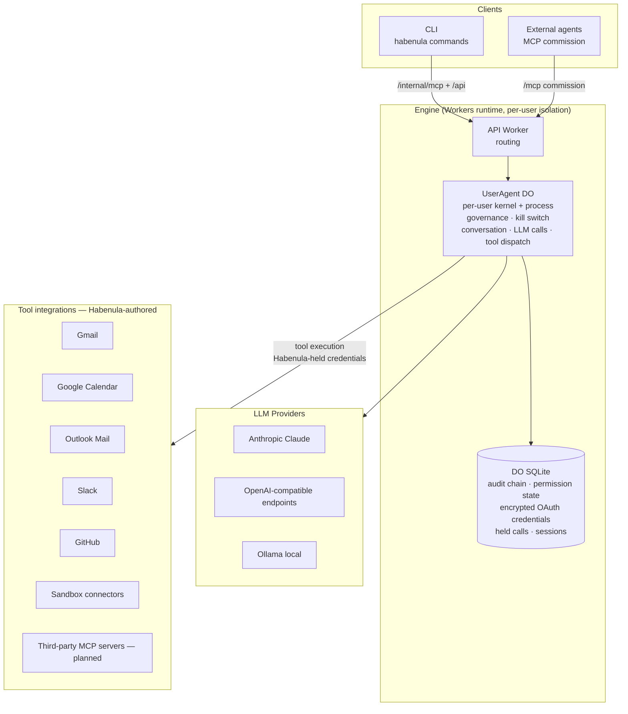

# Architecture Overview

The engine's structural map: the layers, the OS-primitive mapping, and the domain boundaries. For the narrative — how the pieces enforce the contract, where it runs, the OSS/hosted boundary — see the [architecture whitepaper](../whitepapers/architecture.md). For the governance pipeline in detail, see [governance.md](governance.md).

## System Layers

This release runs **one Durable Object per user** — the `UserAgent` DO carries both the kernel (governance, audit chain, kill switch) and the process (conversation, LLM calls, tool dispatch). The planned multi-agent topology splits those roles into a per-user coordinator DO and per-agent worker DOs; where a table below names that split, it is naming the target, and says so.

## Deployment Paths

One trust-kernel codebase, several ways to run it; the [architecture whitepaper §4](../whitepapers/architecture.md) covers the parity guarantee (Miniflare embeds the identical `workerd` Cloudflare ships, so Durable Object single-threading and `transactionSync()` semantics hold on every path).

| Path | Runtime | State | Role |
|------|---------|-------|------|
| Hosted (Cloudflare) | Workers + Durable Objects at the edge | DO SQLite on the platform | Planned hosted deployment; not running today |
| Local container self-host | `habenula-engine` daemon (Node hosting the wrangler-bundled Worker under Miniflare) | DO SQLite on a mounted volume | Run the OSS locally; loopback only, no engine auth ([runbook](../../../../SELF-HOSTING.md)) |
| Local host-run (npm) | the same daemon via `npx @habenula-ai/engine` | DO SQLite under `~/.habenula` | Same engine, no container and no checkout; loopback only |
| Dev loop | `wrangler dev` (also Miniflare) | DO SQLite under `.wrangler/state` | Engine development |

## The OS Analogy

Habenula is structurally an operating system for AI agents. The mapping is precise:

| OS Primitive | Habenula Equivalent |
|-------------|---------------|
| Processes | Accountable agents — one worker DO per agent (real V8 isolate, not namespacing) in the multi-agent split; one per-user DO today |
| Process isolation | Scoped noun grants today — isolation is session-scoped, a stated limit; separate memory, SQLite, and MCP connections per agent arrive with the multi-agent split |
| Permissions / ACLs | `(agent, service, verb, noun) → Decision` tuples |
| Syscall dispatch table | Habenula-owned tool registry — maps tool calls to (service, verb, noun) |
| Credential storage / keychain | OAuth vault (AES-256 encrypted on the connected_services DO SQLite row) |
| File system | Tool-integration layer (governed access to services) |
| Syscall interface | The internal drive surface (MCP) for control ops; governed dispatch for tools |
| Logging / syslog | Append-only audit log with hash chain |
| Kill signals | Kill switch (global today; per-agent and per-service arrive with the multi-agent split) |
| Heartbeat / watchdog | Dead man's switch — the session proposes termination on its clock; no renewal = stop |
| Sockets and pipes | Governed tool dispatch today; inter-agent message passing and WebSocket channels to clients arrive with the multi-agent split; third-party MCP connections are planned |

Inter-agent "sockets and pipes" — agent-to-agent messaging, governed at the coordinator on every hop — are the least-built primitive; they arrive with the multi-agent split. The two inbound surfaces (`/mcp` commission, `/internal/mcp` drive) are detailed in [inbound-mcp.md](inbound-mcp.md).

## Domain Boundaries

| Domain | Owns | Does Not Own |
|--------|------|-------------|
| Agent Runtime | Provider-agnostic LLM client, session state, conversation history, accountable agent isolation, the session clock (configurable heartbeats are planned) | Permission decisions, credential storage |
| Tool Registry | MCP tool → (service, verb, noun) mapping, verb vocabulary | Permission evaluation, tool execution |
| Governance | Permission eval on (agent, service, verb, noun), confirmation flow, kill switch | Tool execution, credential issuing, tool classification |
| OAuth/Credentials | Token lifecycle, OAuth flows, local credential deletion on disconnect | Permission logic, session management |
| Audit Log | Append (DO SQLite), hash chain, integrity verification, records service/verb/noun/toolName | Analysis, alerting, digest generation |
| Observability (planned) | Digest generation, behavioral heuristics | Raw log storage |
| Habenula Store (planned) | Curated integrations | Individual user data, tool registry authoring |
