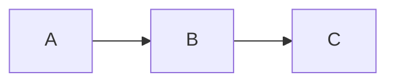

# Contributing

Patterns, conventions, and process for working in this codebase.

---

## Landing PRs

Small, self-contained changes land as a single PR. Work significant enough to require a design spec and engineering plan lands in two stages: a spec PR (the spec documents alone, reviewed and merged first) followed by one or more implementation PRs. One GitHub tracking issue spans both stages, and only the final implementation PR closes it.

---

## Design decisions

For consequential architectural decisions, describe the chosen path and the alternatives considered in the PR description. The architecture, governance, and security whitepapers under `docs/whitepapers/` are the place to consolidate decisions that future readers will want to find.

---

## Diagrams

All diagrams are **Mermaid inline in Markdown files**. Do not use external diagram tools, image files, or links to third-party diagram renderers. Mermaid renders natively in GitHub and stays version-controlled alongside the docs.

```markdown

```

Use these diagram types:
- `flowchart` — processes, pipelines, decision flows
- `sequenceDiagram` — request/response flows, multi-party interactions
- `graph` — system architecture, component relationships
- `erDiagram` — data models (when needed)

Two rules keep diagrams legible:
- **One representation per idea.** A diagram *replaces* the prose walkthrough of a flow — it does not accompany it. Never render the same process as prose *and* an ASCII sketch *and* a diagram; pick the single clearest form and cut the rest.
- **Short node labels.** A node label is a few-word step name (`resolve credential`, `deny + audit`), not a sentence. Put detail in the surrounding prose. Long labels wrap badly, blow out the layout, and don't render legibly.

**GitHub rendering (silent-failure gotcha).** GitHub renders `mermaid` code blocks natively, but silently fails the whole diagram with **"Unable to render rich display"** on any syntax it cannot parse. Keep to vanilla, widely-supported syntax and avoid the frequent breakers:
- No `;` inside node, edge, or message text — mermaid reads `;` as a statement separator, so a semicolon in a `sequenceDiagram` message aborts the parse.
- Do not chain a labeled edge with further edges on one line (`A -->|x| B --> C`) — split it into separate statements.
- Prefer simple node shapes and short labels.

The failure is invisible in most local previews. Before you request review, open the rendered Markdown view (a PR's "Files changed" tab) and confirm the diagram draws.

---

## Adjacent Concerns

Every PR that introduces a meaningful change should include a note on adjacent concerns — things the change touches that weren't the focus of the change. These either get addressed in the same PR, noted as follow-up issues, or added to the appropriate backlog doc.

---

## Adding a Service Setup Guide

A new integration needs setup documentation, and it goes in one place with one shape. Do not start a new pattern.

**If the service is on a provider that already has a guide** (a second Google service, for example), do not add a file. Extend the existing `docs/connect/<provider>.md`:

- [ ] Add the service's own step — its API enablement, its permissions, or its scopes.
- [ ] Add the service to the scopes reference.
- [ ] Add a row to the service→provider table in `docs/connect/_index.md`.

**If the service is on a new provider**, add `docs/connect/<provider>.md` and follow the shape of the four existing guides:

- [ ] Title is `# Connecting <Provider>`.
- [ ] Opening paragraph states that the operator registers the app, that one registration authorizes the whole provider, and that the LLM and CLI never see a raw token.
- [ ] A companion-docs list linking `_index.md`, the integration's architecture doc, and `../architecture/oauth-credentials.md`.
- [ ] A "What you're setting up" table: variable, source, destination.
- [ ] Prerequisites, then numbered steps. Number them **Step**, never "Phase" — a roadmap-phase scanner flags that word on public surfaces.
- [ ] A scopes reference and a redirect URI reference.
- [ ] A Verify section and a Troubleshooting table keyed by the literal error string the operator sees.

Either way, reconcile the shared surfaces:

- [ ] Add rows to every table in `docs/connect/_index.md`: service→provider, who registers what, redirect rules, one-way doors, and the environment-variable inventory.
- [ ] Add the client ID and secret to `packages/engine/.dev.vars.example` and `packages/engine/.env.example`, commented out.
- [ ] Declare the new variables in `packages/engine/src/env.ts` (`HabenulaEnv`), including the `OAUTH_REDIRECT_BASE_URL_<PROVIDER>` form.
- [ ] Add the same names to `FORWARDED_BINDINGS` in `packages/engine/src/daemon/start.ts`. That array is an allowlist for the container run path. A name missing from it is dropped in silence, so the provider works under `wrangler dev` and fails for every container operator.
- [ ] Add the new secret to the environment-variable inventory (`docs/connect/_index.md`).
- [ ] Add the guide to `docs/INDEX.md` under Connecting Services.

`docs/connect/_index.md` is the canonical inventory of environment variables. When a variable changes, update it there first, then propagate to the example files.

---

## Security Checklist (Every PR Touching Sensitive Code)

For changes to the governance pipeline, credential management, or audit log:

- [ ] No raw OAuth token appears in logs, responses, or LLM context
- [ ] Policy evaluation remains a pure function with no side effects
- [ ] Audit log writes happen before (not after) tool execution
- [ ] New configuration or state added to DOs is persisted before hibernation is possible
- [ ] No new KV reads that assume strong consistency

---

## Code Style

TypeScript strict mode with ESLint, enforced by `just engine-lint` (and the
`just pre-commit` gate). Run it before every commit. The pre-commit hook runs it
for you and cannot be bypassed without `--no-verify`.

---

## Testing

Tests run inside the real Workers runtime via `@cloudflare/vitest-pool-workers` — `just engine-test`. The strategy, in priority order:

- **Test the governance evaluation as a pure function first.** `(policy, action) → decision` is the most critical code and the easiest to test in isolation — no I/O, no runtime. Cover allow, deny, and the held (confirm) path independently.
- **Test the audit hash chain independently of the DO** — write entries, verify the chain, tamper with one entry, confirm the chain breaks.
- **Never mock the platform primitives.** Integration tests exercise the real bindings through the Workers pool (DO SQLite in this release); mocking them hides the behavior that matters — hibernation, consistency, transactions.
- **Enter through the HTTP boundary when correctness depends on it.** A `runInDurableObject()` test supplies the Durable Object's arguments itself. It cannot see a defect in the handler that builds them. So any behavior that spans two requests — a session, a held tool call, a grant, a spend window — gets at least one test that drives the real route with `worker.fetch`. Use the helpers in `test/helpers/http.ts`. Seed on `stubFor(userId)`, because the routes derive the Durable Object by name. Keep the DO-method test as well; it covers the primitive in isolation.
- **Layers:** unit (pure functions — permission eval, hash chain), integration (Worker + DO + SQLite through the Workers pool), and end-to-end against a running engine.

Define the cases before the implementation. That matters most for:

- the governance pipeline
- the audit chain (write / read / verify / tampered entry)
- the OAuth flow (connect and single-flight token refresh)
- the kill switch (grants cleared to the deny floor, held calls swept, connections and credentials preserved)
- session persistence across hibernation

---

## Branches & Commit Messages

One naming scheme across branches, commits, and PR titles. Every branch has a tracking issue.

**Branches — `<initials>/<doctype>-<NNNN>-<slug>`.** `<doctype>` is `design-spec`/`eng-plan` for spec work, or the conventional-commit type otherwise. `<NNNN>` is the four-digit tracking-issue number. The separator is `/`, never `+`. When an issue's implementation lands as a series of phase PRs, a phase letter (A, B, C… — one per PR, in landing order) suffixes the number directly: `<initials>/<type>-<NNNN><phase>-<slug>`.
```
jg/design-spec-0073-collapse-service-constants
jg/refactor-0073B-oauth-providers-strategy-table
kv/feat-0024-schema-codegen
```

**Commits & PR titles — conventional commits `type(scope): description`.** Types: `feat`, `fix`, `docs`, `refactor`, `test`, `chore`, `ci`. Scope is the doctype for spec/plan docs (`design-spec`/`eng-plan`), the package for code, or the doc area for other docs. Every PR title leads the description with the tracking-issue number — `type(scope): NNNN - description`, plain hyphen separator. A PR that is one phase of a multi-phase plan suffixes a phase letter onto the number: `type(scope): NNNN<phase> - description` (e.g. `0073A`). Commit subjects stay clean and reference the issue in the body.
```
docs(design-spec): 0073 - collapse per-service constants into the catalog
refactor(engine): 0073A - module refresh map + capability builder
feat(engine): implement spending limit check in permission pipeline
fix(engine): correct audit-log hash chain on concurrent writes
docs(architecture): add governance pipeline sequence diagram
```
