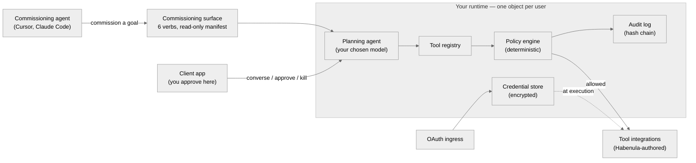

# Habenula — How It Fits Together

The product overview says *what* Habenula is. This document is the layer beneath it: the handful of components the system is built from, how they connect, and the boundaries we drew on purpose. The boundaries are the part worth reading closely: some are unusual, and they are the whole point. For the deepest treatment of any one piece, the architecture, governance, and security whitepapers go further; this is the map.

## Two ways it's used

- **As a sidecar to a coding agent.** Your agent (Cursor, Claude Code, or a custom one) keeps doing its work. When it needs to take a consequential action, it hands the *goal* to Habenula through the commissioning surface. Habenula plans the governed task, you approve it in a client app, and Habenula executes.
- **Standalone.** You talk to an agent Habenula runs itself, in the client app, on a model you choose. Same governed path underneath.

## The shape

## The components

**Client apps.** The human's surfaces — at launch, the command-line client that runs on your machine; more surfaces later. This is where you converse, review a held action, approve or narrow or deny it, and hit the kill switch. It is the surface you control, and it is deliberately *not* a surface any agent can drive.

**The commissioning surface.** The single inbound door for an outside agent. It is six verbs wide. An outside agent can commission a goal, check that the runtime is alive, and read how a run ended. For a run it commissioned, it can also supply a value the run is waiting on, correct that value, or cancel the run. Alongside it sits a read-only capability manifest that says which services and verb classes exist — and nothing that can be invoked. That is the whole of it. There is no tool to call, no policy to write, no approval to give.

**The planning agent.** The agent Habenula runs inside your runtime, on the model you chose. It takes a goal — a commissioned intent, or your side of a standalone conversation — and turns it into proposed tool calls. It is a brilliant proposer and nothing more: it decides *what to attempt*, never *what is permitted*.

**The tool registry.** Habenula's own map from a raw tool call to an abstract `(service, verb, noun)` action. Integrations do not classify themselves; Habenula authors every entry. Classification happens *before* anything is evaluated, so a wrong label can only fail closed, never sail through.

**The policy engine.** A pure function that compares the classified action against the grants you've made and returns allow or deny. Holding an un-granted call for your decision is the surrounding pipeline's job, not the function's — which is what keeps the function pure. No I/O, no network, no model — same inputs, same answer, every time. Deny is the substrate: a fresh agent can do nothing.

**The credential store.** Your OAuth tokens, encrypted at rest in your own per-user database, co-located with the connection they authenticate. Tokens are resolved only at the moment of an allowed call, used for one outbound request, and discarded. The model never receives a token.

**OAuth ingress.** How a service gets connected: Habenula runs the OAuth handshake as the client (PKCE wherever the provider supports it) and the resulting token lands in the credential store. Connecting a service establishes a credential; it grants no agent anything on its own.

**The audit log.** An append-only, hash-chained record in your own database, written *before* each action runs and tagged with where the action came from (your own session, or an outside commission). You can dump it and recompute the chain yourself, which shows that nothing inside the dumped range has been altered or reordered.

## The boundaries we drew on purpose

This is the reason the document exists. The components above are ordinary; the lines *between* them are not.

**Commissioning is not approving.** The surface an outside agent submits work through is structurally incapable of approving that work. An agent commissions an *intent*; a human approves on a client app the agent cannot reach. These are different doors, held apart by construction — the same separation of duties a bank puts between the person who requests a wire and the person who releases it. It is why the commissioning surface has no approve verb: not as a policy you could toggle, but because the door was never built.

**Planning proposes; the runtime disposes.** The planning agent — the clever, model-driven part — only ever *asks*. What is actually allowed is decided by the deterministic policy engine, in code the model cannot reach or argue with. We assume the model can be manipulated or simply wrong, so nothing about what an agent may *do* depends on the model's judgment. Wanting and doing are separated by code.

**There is no direct door to the gate or the tools.** You cannot call the policy engine. There is no route that runs a tool around the gate. A tool runs only after it passes a check, when the one governed path dispatches it: classify, evaluate, price it if it spends money, record, then execute. There is no side entrance that reaches a credential-holding tool while skipping the gate, because a governed runtime with a side door is not governed. This is why the outside surface is a closed verb set and a read-only manifest, and nothing more: everything consequential is reachable *only* through the path that governs it.

**The model and the credentials never meet.** The model-facing path (conversation, proposed calls, results) and the execution path (credential resolution, the outbound call) cross only at the policy engine. The promise that a hijacked agent cannot spend keys it never held is a consequence of that routing, not a filter bolted on top.

## Reading further

The architecture whitepaper maps where each component runs and how the same code deploys from a laptop to a hosted service; the governance whitepaper covers the decision model the policy engine enforces; the security whitepaper takes the adversary's view. This document is the doorway to all three.
