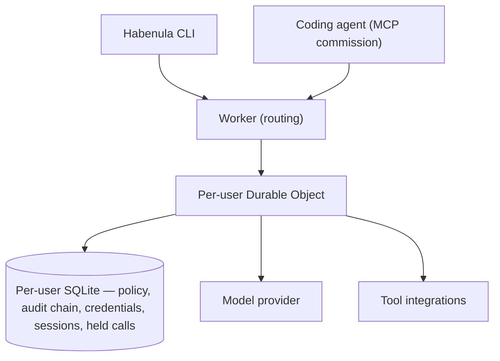

# Architecture: The Machine That Enforces the Contract

**Habenula Whitepaper · RFC v1.0**

> **Status: Request for Comments.** This paper describes how Habenula is built — where each component runs, where the trust boundaries sit, and how the same code deploys from a laptop to a hosted service. It documents the system as implemented in the current release, with the planned topology marked as such. The governance whitepaper covers the decision model this machine enforces; the security whitepaper covers the adversary's view.

---

## 1. The shape of the system

Habenula is a small system, deliberately. One Worker routes requests. One Durable Object per user holds everything that matters about that user — their policy, their audit chain, their credentials, their session. A command-line client talks to the Worker; an MCP endpoint lets outside agents commission goals. There is no separate policy service, no logging pipeline, no middleware tier: governance is function calls inside the runtime, which is why there is no route around it.

Three facts about this shape carry most of the security story:

1. **Per-user isolation is structural, not a filter over a shared store.** Each user's Durable Object is a separate single-threaded instance with its own embedded SQLite database. There is no shared mutable state between users to partition, and no cross-tenant query surface to misconfigure. When running on Cloudflare the separation is physical as well, because the platform places and schedules each object independently. The single-node container keeps the same object-and-database boundary, but inside one `workerd` process on one machine.
2. **Everything consequential is in one strongly-consistent place.** Policy grants, the audit chain, encrypted credentials, session state, and held calls all live in the user's own SQLite — read-after-write, transactional, and co-located with the code that uses them. Nothing on a security-critical path traverses an eventually-consistent store.
3. **The model and the credentials are on different paths.** The model-facing path (conversation, tool-call requests, results) and the execution path (credential resolution, outbound API calls) meet only at the governance pipeline. The paper's central boundary — the model never sees a credential — is a consequence of this routing, not a filtering rule.

## 2. The runtime

### 2.1 One object per user

The per-user Durable Object is the unit of the design. It is single-threaded, which the audit chain exploits: the read-previous-hash → compute → insert sequence runs inside a synchronous transaction with no possibility of interleaving. Single-threading belongs to the object model itself, so it holds wherever the engine runs.

Two further properties belong to the platform rather than to the code, and hold when running on Cloudflare. The object is globally addressed, so a user's requests converge on their state wherever they connect from. And it hibernates when idle: an inactive agent holds durable state but consumes nothing, which is what makes many long-lived agents economically boring rather than a fleet-management problem. The single-node launch container reproduces neither, and §4 is precise about what each way of running does and does not give you.

Everything the object must remember survives hibernation in its SQLite: the policy entries, the audit chain, the encrypted credentials on their connection rows, the active session, and — notably — **held calls**. When governance parks an un-granted action awaiting the user's decision, the entire in-flight turn state is persisted; the object can hibernate mid-hold and resume with the parked parameters intact and unaltered.

### 2.2 Kernel and process: the topology this becomes

The design is an operating-system analogy carried unusually far: agents are processes; grants are file permissions; the tool registry is the syscall dispatch table; the audit chain is the syslog; kill is a signal. In the current single-agent release, one Durable Object plays both roles — kernel (policy, audit, kill, sessions) and process (conversation, model calls, tool execution) — behind interfaces that already separate them.

The planned multi-agent topology splits the roles across objects: one **coordinator** per user holding the kernel state, and one **worker** per agent holding that agent's conversation and connections, calling into the coordinator for every governance check. The split is how per-agent isolation becomes physical: a crashed, hung, or compromised agent is one worker object, not the user's world. It is also why the interfaces exist now — the evaluation function and audit writer do not care whether they are called locally or over an object-to-object channel. Governance round-trips between objects cost single-digit milliseconds; model calls cost seconds. The kernel is never the bottleneck because the kernel only ever does microsecond work.

### 2.3 The execution path

A chat turn runs: user message → model → tool-call request → **registry lookup → policy evaluation → audit write → execute-or-hold** → result back to the model → next turn. The four bold steps are the governance pipeline, documented in the governance whitepaper; architecturally, the point is *where* they run — inside the user's object, on the only path between a model request and an outbound call. Turns are serialized per user: a second turn attempted while one is in flight is refused rather than interleaved, so the conversation state has one writer.

Habenula uses MCP at its inbound edges: outside agents commission goals over the MCP commission endpoint, and the CLI drives the agent over the internal MCP interface (§3).

Every tool the agent can run is one Habenula has modeled and integrated — mapped through the registry to a `(service, verb, noun)`, run under the same pipeline, with anything unregistered held for confirmation. Today those integrations are direct clients we wrote and run in-process; some may arrive over MCP later. That choice of transport doesn't matter to governance — the modeling does. A tool the registry describes can be classified precisely; a tool left to describe itself cannot. So new integrations are ones Habenula models and vets, not servers wired in blind.

All integrations are declared in a single service catalog: which service exists, how it authenticates, which tools it contributes. The tool registry and credential machinery derive from that one source of truth. Adding a second service on an existing OAuth provider adds scopes and tools, not new OAuth code.

## 3. Inbound surfaces

Two doors into the runtime, with deliberately different shapes:

- **The CLI** is the human's surface: conversation, service connection, status, resolution of held calls, kill. It is open source and runs on the user's machine — the trust boundary a user can read.
- **The MCP commission endpoint** is the outside agent's surface, and it is six verbs wide: commission a goal, check liveness, read run status, then supply or correct an input, or cancel a commissioned run. A commissioned goal attaches to the user's session and runs as a normal governed turn — same pipeline, same holds, same audit chain, with every resulting entry origin-tagged as commissioned, tamper-evidently. A read-only capability manifest tells the caller what services and verb classes exist, without exposing anything invocable. There is no tool surface and no approve verb; the governance whitepaper §6 explains why that asymmetry is the point.

In this release both surfaces are local, behind a loopback-only guard. The CLI's own transport additionally requires a shared caller token, but the token gates only that transport — it is not user authentication, and it does not guard the approval channel. A local process on the machine can resolve a held call through the runtime's API; the machine itself is this release's trust boundary. Inbound authentication is next-phase work; the security whitepaper §5 states the residual plainly.

## 4. Where it runs: one codebase, more than one way to run it

The deployment story is a trust claim, so state it exactly.

The runtime is built on Cloudflare's Workers platform — V8 isolates plus Durable Objects. The launch release ships two ways to run it — a self-contained `workerd`+CLI container and the packages on npm — with more to follow on the same code.

**At launch — the container.** A `workerd`-plus-CLI container that runs on any Docker host: the way to run and explore the whole product yourself. It bundles the same open-source runtime local development already uses — `wrangler dev` runs on Miniflare, which executes on `workerd` — so the thing you run is the product, not a hosted service with an open-source demo sibling. `workerd` is Cloudflare's own Apache-2.0 open-source runtime, so the container has no dependency on Cloudflare the company at runtime, though it is not free of Cloudflare-authored code, and we will not blur that line. It is single-node: no global edge distribution, no hibernate-to-zero economics. It is your infrastructure, and the credential master key lives in Habenula's own secret store — but that store runs on your machine, so the company never possesses the key and cannot decrypt anything remotely. Putting the at-rest key in a secret store of your own choosing is a fast-follow, not a launch capability, and we state that rather than imply otherwise. (Running the engine from source under `wrangler dev` is the same runtime, unpackaged — the contributor path the README walkthrough uses, not a separate deployment.)

**At launch — the packages.** The same runtime also publishes to npm: `npx @habenula-ai/engine` runs the engine on loopback and `npx @habenula-ai/cli` the CLI, with no container and no repository checkout — the identical code and governance, delivered as packages rather than an image.

**What follows, in order, all on the same code:** self-hosted on your own **Cloudflare account** (ships next — the published configuration on your own account, adding the global edge distribution and hibernate-to-zero economics the single-node container does not reproduce); a **hosted** service operated by Habenula, Inc.; and a **multi-node, non-`workerd`** port for horizontal scale beyond a single object.

The claim that matters is parity, not liveness: the container you run and the hosted service that follows are the *same isolates, same SQLite, same hash chain, same code*. The open artifact is the product; hosted will be the same engine operated for you, not a richer closed sibling.

### 4.1 Why this platform

Chosen for a mechanical reason: per-user singleton objects with embedded, transactional SQLite are *precisely* the primitive a per-user governance kernel needs — strong consistency for policy and kill, single-threading for the hash chain, hibernation for economics. We use the platform natively rather than through a lowest-common-denominator abstraction, and we are explicit about the trade. We are deliberately abstracting the platform-coupled surfaces — the storage, queue, and inference seams sit behind interfaces — precisely so that decoupling from Cloudflare is a bounded, planned project down the line rather than a rewrite. The honest caveat is that the object model itself is still platform-coupled, and porting it would be real work; the seams shrink that work, they do not yet erase it. The decoupling is tracked as a bounded project, not a someday — the seams are already in place, and we can prioritize the port off Cloudflare if user demand for a non-Cloudflare deployment warrants it. That honesty is cheaper than a portability theater that would cost the properties the platform was chosen for.

### 4.2 Where each component runs

Habenula is not one deployable but several components along its trust seams — the runtime engine, the credential ingress that runs the OAuth client, the secret store that holds the master key. Each can be placed independently, on the operator's own infrastructure or on Habenula's, and the direction is not fixed. An operator can hold their own secret store while Habenula hosts the engine, or run the engine themselves and reach a Habenula-hosted ingress so they need not register OAuth apps with each provider. Which side each component sits on is the operator's call, taken one component at a time rather than once for the whole system; each such placement's cost to credential custody is stated in the security whitepaper (§3.4).

The principle is that the boundary is drawn per component, by the operator, not fixed at the whole-system edge. The rollout runs from the sovereign end outward: the fully self-hosted placement ships today, and each hosted component is convenience layered on top of it — offered, never required.

## 5. The open-source / hosted boundary

The OSS runtime is not a mirror of the hosted product; it is the hosted product's core, consumed the same way any outsider could consume it. The intended shape is that a hosted service composes on top of the published engine through typed extension seams — identity, billing gates, retention, telemetry — with a short list of **non-extension points** locked by design. No hosted service exists yet and neither do those seams; what follows is the boundary being committed to, not a description of running code:

> The policy evaluator, the hash-chain logic, the permission-model semantics, the credential path that keeps tokens out of model context, and the Durable Object classes themselves are to be identical bytes in OSS and hosted. Hosted may add policies, retention, and services; it cannot override *how* policy is evaluated, *how* the chain is written, or *what* the model can see. No feature flags in OSS code, no subclassing of the safety core.

The reason is auditability: a self-hoster reading the open code and a hosted user must be reasoning about the same trust model, or the openness is theater. The verification chain is designed with cryptographic links: published packages will carry build provenance tying artifacts to public commits, and hosted deploys will be declared in a signed, append-only transparency log. One honest gap remains: no public primitive currently attests which bytes a cloud worker is *executing*, so the runtime-execution claim rests on declared deploys plus audits, not cryptography. The property this buys is that lying would be expensive and visible, not impossible — and we would rather publish that sentence than a stronger one we cannot back.

## 6. Platform constraints the design absorbs

Honest architecture papers include the gravity. The constraints that shaped real decisions:

- **Hibernation forgets memory.** Anything not written to SQLite before an await may not exist afterward. This is why held calls persist their entire turn state, and why "in-memory only" is treated as a bug class, with one deliberate exception: the turn-serialization flag is in-memory *on purpose*, so a crash can never wedge a user's object permanently behind a stuck flag.
- **Eventually-consistent storage is banned from security paths.** The platform's KV store propagates in up to a minute and throttles writes per key; nothing on the credential, policy, kill, or counter paths touches it.
- **Deploys drop live connections.** Clients reconnect and resume from persisted state; the design assumes disconnection as a normal event, not an incident.
- **A 10GB ceiling per user's database.** Generous for metadata-only audit entries, but finite. Nothing deletes or archives an entry in this release; the epoch design is what will let retention windows and archival be added integrity-safe (§4.1 of the security whitepaper explains how).
- **Pre-1.0 dependencies move.** Every dependency is pinned exactly — no version ranges anywhere — with a minimum-age policy before adopting releases, because a governance runtime inheriting a surprise API change from a fast-moving SDK is a security event, not an inconvenience.

## 7. What changes next

Two architectural deltas are scheduled, each already visible as a seam in the current code: the **coordinator/worker split** (§2.2), turning per-agent isolation from a session property into a physical one; and **account authentication and inbound token scoping**, turning the loopback boundary into real containment with commission-only tokens for outside agents. A nearer-term delta is a **bring-your-own secret store** for the credential master key: today the launch container bundles the store the at-rest key lives in (§4), and letting the operator supply their own — their KMS, their secret manager — is a planned fast-follow. The model already sits behind one interface — a per-deployment choice across any provider, the architectural half of the commitment that the control harness is not owned by any model vendor — so that is current-state, not a scheduled delta. The public roadmap sequences the rest, alongside the deployment path from the launch container to a hosted service.

## 8. Reading the code against this paper

The repository is small enough to audit in an afternoon, and structured for it: the governance module (pure evaluation), the credentials module (crypto, store, refresh), the data layer (the schema is a single hand-written DDL registry from which the typed row schemas are generated), the agent object (pipeline, holds, sessions, kill), the commission server, and the CLI. The test suite runs in the real Workers runtime with unmocked platform primitives, and the invariant-critical behaviors — credential isolation, chain tampering, deny-floor evaluation, held-call resumption — are covered by tests you can run with one command from a fresh clone. Start at the README's walkthrough; everything in this paper is reachable from there.
